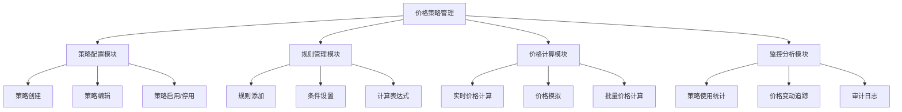
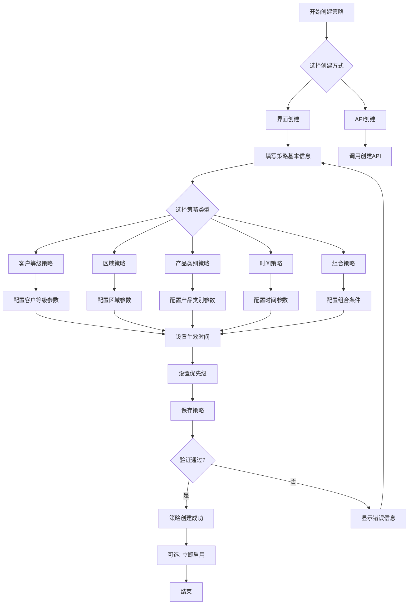
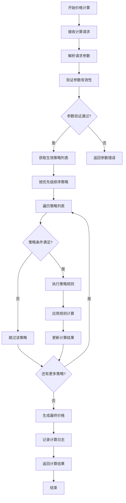
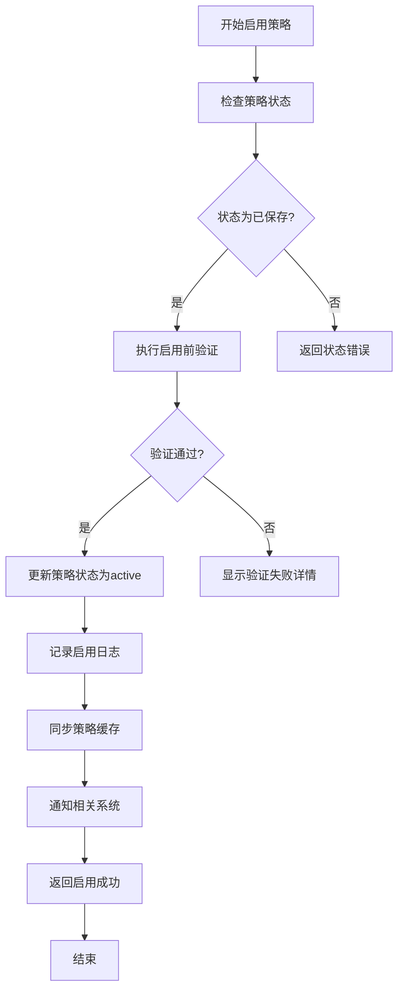
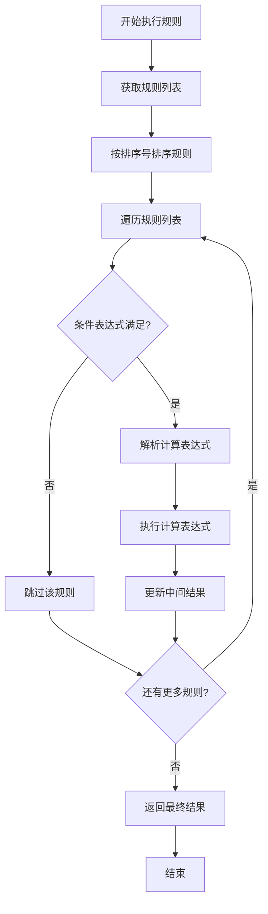
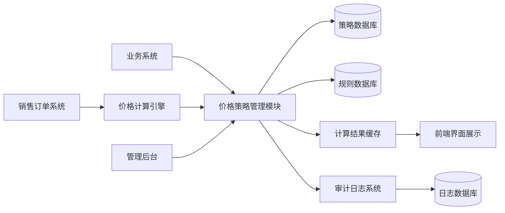

# 销售价格策略管理功能用户指南

## 第一章：功能概述和系统入口

### 1.1 功能简介
销售价格策略管理功能是AI-Ready ERP系统中专门用于管理和执行复杂定价策略的核心模块。通过该功能，企业可以实现：

- **多维定价**：基于客户等级、区域、产品类别、时间等多种维度制定价格策略
- **灵活折扣**：支持数量折扣、客户折扣、区域系数等多种折扣规则
- **智能计算**：自动根据预设策略计算最优价格
- **促销管理**：管理各类促销活动，如季节性促销、节假日促销等
- **策略冲突处理**：通过优先级设置解决多策略冲突问题

### 1.2 功能价值
**业务价值**：
- 提升定价灵活性，快速响应市场变化
- 精细化客户分层，实现差异化定价
- 提高销售利润，优化价格策略
- 自动化价格计算，减少人工操作错误

**管理价值**：
- 统一价格管理，避免价格混乱
- 完善的价格审计和变动追踪
- 数据驱动的定价决策支持
- 策略效果监控和优化

### 1.3 系统入口
销售价格策略管理功能可以通过以下两种方式访问：

#### 1.3.1 Web界面访问
1. 登录AI-Ready ERP系统
2. 进入主菜单，选择"销售管理"模块
3. 在左侧导航栏中点击"价格策略管理"
4. 进入价格策略管理主界面

**访问路径**：
```
ERP系统首页 → 销售管理 → 价格策略管理
```

#### 1.3.2 API接口访问
开发人员可以通过以下API接口访问价格策略管理功能：

**基础路径**：
```
https://<服务器地址>/api/sale/pricing/
```

**主要接口**：
- `GET /strategies` - 获取价格策略列表
- `POST /strategies` - 创建价格策略
- `POST /calculate` - 计算产品价格
- `POST /simulate` - 模拟价格计算

### 1.4 适用角色
本功能主要适用于以下角色：

| 角色 | 主要职责 | 使用频率 |
|------|---------|---------|
| 销售总监 | 制定整体价格策略，审批重要策略 | 日常 |
| 销售经理 | 创建和维护价格策略，监控策略执行 | 日常 |
| 销售专员 | 使用策略进行价格计算，查看价格信息 | 高频 |
| 技术支持 | 协助配置策略，处理技术问题 | 按需 |
| 系统管理员 | 权限分配，系统配置维护 | 定期 |

### 1.5 使用前提
在使用价格策略管理功能前，请确保：

**系统条件**：
- ✅ ERP系统已正常部署并运行
- ✅ 用户已获得相应权限（价格策略管理权限）
- ✅ 相关模块已激活（销售管理模块）

**业务数据准备**：
- ✅ 客户信息已录入系统
- ✅ 产品目录已建立完整
- ✅ 客户等级体系已定义
- ✅ 区域编码体系已配置

**权限要求**：
- 查看策略：销售专员及以上
- 创建策略：销售经理及以上
- 修改策略：销售经理及以上
- 删除策略：销售总监及以上
- 启用/停用策略：销售总监

### 1.6 功能模块概览
价格策略管理功能包含以下主要模块：



### 1.7 版本信息
| 项目 | 信息 |
|------|------|
| 功能版本 | v1.0.0 |
| 适用系统 | AI-Ready ERP v3.2+ |
| 首次发布 | 2026年4月 |
| 文档版本 | v1.0.0 |
| 最后更新 | 2026-04-30 |

### 1.8 技术支持
在使用过程中遇到问题，可通过以下方式获取帮助：

**内部支持**：
- 技术支持热线：400-xxx-xxxx
- 内部工单系统：ticket.ai-ready.com
- 技术文档中心：docs.ai-ready.com

**在线帮助**：
- 功能帮助中心：点击界面右上角"帮助"按钮
- 在线教程视频：help.ai-ready.com/videos
- 常见问题解答：FAQ.ai-ready.com

### 1.9 文档约定
本用户指南使用以下约定：

**图标约定**：
- ✅ 表示已完成或正确操作
- ⚠️ 表示注意事项或警告
- ❌ 表示错误操作或禁止行为
- 💡 表示提示或建议

**示例格式**：
```
示例：API调用示例会以代码块形式展示
```

**特殊说明**：
> 重要提示或特殊注意事项会以引用块形式展示

---

## 第二章：价格策略创建

### 2.1 策略创建入口
创建价格策略有两种主要方式：

#### 2.1.1 界面创建
1. 登录ERP系统，进入销售管理模块
2. 点击左侧菜单中的"价格策略管理"
3. 在价格策略列表页面，点击右上角的"新建策略"按钮
4. 系统弹出策略创建对话框

#### 2.1.2 API创建
通过API接口创建策略：
```http
POST /api/sale/pricing/strategies
Content-Type: application/json

{
  "name": "战略客户9折优惠",
  "description": "针对战略客户的长期9折优惠策略",
  "strategyType": "customer_level",
  "customerLevel": "strategic",
  "discountRate": 0.1,
  "priority": 10,
  "effectiveFrom": "2026-04-30 00:00:00"
}
```

### 2.2 策略创建界面详解
策略创建对话框包含以下区域：

#### 2.2.1 基本信息区域
```
+-----------------------------------+
| [基本信息]                        |
| 策略名称：____________________   |
| 策略描述：____________________   |
| 策略类型：○客户等级 ○区域       |
|        ○产品类别 ○时间 ○组合    |
| 优先级：____ (1-100)             |
+-----------------------------------+
```

**字段说明**：
- **策略名称**：必填，建议使用清晰易懂的名称，如"战略客户折扣"
- **策略描述**：选填，详细说明策略用途和适用场景
- **策略类型**：必选，决定策略的维度和适用条件
- **优先级**：必填，数字越小优先级越高（1-100）

#### 2.2.2 策略参数配置区
根据选择的策略类型，显示不同的参数配置选项：

**客户等级策略**：
```
适用客户等级：○战略客户 ○核心客户 ○普通客户
折扣率：___% 或 价格系数：___
```

**区域策略**：
```
适用区域编码：________ (多个用逗号分隔，如BJ,SH,GZ)
区域价格系数：___ (1.0为标准价)
```

**产品类别策略**：
```
产品类别ID：________
折扣率：___% 或 基础价格：___
```

**时间策略**：
```
时间系数类型：○固定系数 ○时间范围系数
系数值：___ (如0.95为95折)
```

**组合策略**：
```
组合条件：
□ 客户等级 □ 区域 □ 产品类别 □ 时间
复合计算方式：○AND(且) ○OR(或)
```

### 2.3 生效时间设置
#### 2.3.1 生效时间选项
```
+-----------------------------------+
| [生效时间]                        |
| 生效开始：2026-04-30 00:00:00    |
| 生效结束：________ (可选)        |
| 是否立即生效：○是 ○否            |
+-----------------------------------+
```

**生效时间配置说明**：
- **生效开始**：必填，策略开始生效的时间
- **生效结束**：选填，如果不填表示永久有效
- **立即生效**：如果选择"是"，则策略创建后立即生效

#### 2.3.2 时间格式要求
- 日期格式：YYYY-MM-DD
- 时间格式：HH:mm:ss
- 示例：2026-04-30 09:00:00

### 2.4 优先级配置
#### 2.4.1 优先级规则
- **优先级数字**：1-100，数字越小优先级越高
- **默认优先级**：50
- **系统预定义优先级**：
  - 紧急策略：1-10
  - 重要策略：11-30
  - 常规策略：31-70
  - 通用策略：71-100

#### 2.4.2 优先级冲突处理
当多个策略同时满足条件时：
1. 系统按优先级从高到低（数字从小到大）排序
2. 应用优先级最高的策略
3. 如果优先级相同，按创建时间排序，后创建的覆盖先创建的

### 2.5 策略保存和验证
#### 2.5.1 保存操作
填写完所有必填信息后：
1. 点击"保存"按钮
2. 系统进行参数验证
3. 验证通过后保存策略
4. 返回成功提示，策略进入"已保存"状态

#### 2.5.2 验证规则
系统会自动验证以下内容：

**必填项验证**：
- 策略名称不能为空
- 策略类型必须选择
- 优先级必须在1-100之间

**逻辑验证**：
- 生效开始时间不能晚于结束时间
- 客户等级、区域编码等必须有效
- 折扣率必须在0-100%之间
- 价格系数必须大于0

**冲突验证**：
- 检查与现有策略是否存在冲突
- 验证优先级设置是否合理

### 2.6 创建成功后的操作
策略创建成功后，可以进行以下操作：

#### 2.6.1 立即启用
1. 点击策略详情页的"启用"按钮
2. 系统再次验证策略配置
3. 验证通过后策略状态变为"active"
4. 策略开始生效

#### 2.6.2 暂不启用
1. 策略保持"已保存"状态
2. 后续可以在策略列表中启用
3. 未启用的策略不会参与价格计算

#### 2.6.3 编辑修改
1. 在策略列表中选择要修改的策略
2. 点击"编辑"按钮
3. 修改相关参数
4. 保存修改

### 2.7 创建示例
#### 示例1：创建客户等级策略
```
策略名称：核心客户95折优惠
策略描述：针对核心客户的长期95折优惠政策
策略类型：客户等级
客户等级：核心客户
折扣率：5%
优先级：20
生效开始：2026-04-30 00:00:00
生效结束：2026-12-31 23:59:59
```

#### 示例2：创建区域策略
```
策略名称：一线城市标准定价
策略描述：一线城市标准价格策略
策略类型：区域
区域编码：BJ,SH,GZ,SZ
价格系数：1.0
优先级：50
生效开始：2026-04-30 00:00:00
生效结束：不填（永久有效）
```

#### 示例3：创建组合策略
```
策略名称：战略客户+一线城市特殊优惠
策略描述：战略客户在一线城市的特殊优惠政策
策略类型：组合
组合条件：客户等级=战略客户 AND 区域编码 in (BJ,SH)
折扣率：8%
优先级：5
生效开始：2026-05-01 00:00:00
生效结束：2026-08-31 23:59:59
```

### 2.8 注意事项
⚠️ **重要提醒**：
1. 策略创建后需启用才能生效
2. 优先级的设置直接影响价格计算结果
3. 生效时间设置要合理，避免时间重叠
4. 定期检查已过期策略，及时停用
5. 创建策略前，建议先在测试环境验证

💡 **最佳实践**：
1. 使用有意义的策略名称，便于查找和识别
2. 为每个策略添加详细的描述
3. 优先使用较低优先级设置，避免冲突
4. 设置合理的生效时间范围
5. 创建策略模板，提高创建效率

---

## 第三章：价格规则设置

### 3.1 规则类型介绍
价格规则是策略的具体执行逻辑，支持多种规则类型：

#### 3.1.1 主要规则类型
| 规则类型 | 说明 | 适用场景 |
|----------|------|---------|
| **数量折扣** | 基于采购数量的折扣规则 | 批量采购、阶梯折扣 |
| **客户折扣** | 基于客户等级或特定客户的折扣 | VIP客户、战略客户 |
| **区域系数** | 基于区域的乘数系数 | 区域差异化定价 |
| **时间系数** | 基于时间的乘数系数 | 季节性促销、节假日优惠 |
| **附加费用** | 额外的固定费用或百分比费用 | 运费、手续费、税费 |
| **最小金额** | 设置最低消费金额门槛 | 促销活动最低消费限制 |
| **最大折扣** | 限制最大折扣金额或比例 | 防止过度折扣 |

#### 3.1.2 规则组合
多个规则可以组合使用，实现复杂的定价逻辑：
- **顺序执行**：规则按排序号依次执行
- **条件执行**：基于条件表达式决定是否执行
- **嵌套执行**：规则内可以包含子规则

### 3.2 规则添加和配置
#### 3.2.1 添加规则入口
在策略详情页面添加规则：
1. 进入策略详情页面
2. 点击"规则管理"标签
3. 点击"添加规则"按钮
4. 选择规则类型

#### 3.2.2 规则配置界面
```
+-----------------------------------+
| [规则配置]                        |
| 规则名称：____________________   |
| 规则类型：○数量折扣 ○客户折扣   |
| 排序号：____ (1-100)             |
|                                    |
| [条件设置]                        |
| 条件表达式：____________________ |
|                                    |
| [计算设置]                        |
| 计算表达式：____________________ |
| 折扣率：___%                    |
+-----------------------------------+
```

### 3.3 条件表达式设置
#### 3.3.1 条件表达式语法
```
quantity >= 100                     // 数量大于等于100
amount >= 1000                      // 金额大于等于1000
customerLevel == 'strategic'        // 客户等级为战略客户
regionCode in ('BJ','SH','GZ')      // 区域在北京、上海、广州
productCategoryId == 5              // 产品类别ID为5
date >= '2026-06-01' && date <= '2026-06-30'  // 时间在6月份
```

#### 3.3.2 条件运算符
- **比较运算符**：==, !=, >, >=, <, <=
- **逻辑运算符**：&& (且), || (或), ! (非)
- **成员运算符**：in, not in
- **字符串匹配**：contains, startsWith, endsWith

#### 3.3.3 可用变量
| 变量名 | 类型 | 说明 |
|--------|------|------|
| quantity | number | 采购数量 |
| amount | number | 采购金额 |
| customerId | string | 客户ID |
| customerLevel | string | 客户等级 |
| regionCode | string | 区域编码 |
| productId | string | 产品ID |
| productCategoryId | string | 产品类别ID |
| date | date | 当前日期 |

### 3.4 计算表达式设置
#### 3.4.1 计算表达式语法
```
basePrice * 0.95                    // 95折
basePrice - 10                      // 减10元
basePrice * priceFactor             // 乘以价格系数
min(basePrice * 0.9, basePrice - 20) // 取9折和减20元的最小值
if(quantity >= 100, basePrice * 0.9, basePrice) // 条件计算
```

#### 3.4.2 可用函数
- **数学函数**：abs, ceil, floor, round, sqrt, pow
- **比较函数**：min, max, if, case when
- **字符串函数**：concat, substring, length
- **日期函数**：now, dateAdd, dateDiff

### 3.5 规则排序和优先级
#### 3.5.1 排序号设置
- **排序范围**：1-100
- **执行顺序**：从小到大依次执行
- **默认排序**：10的倍数（10,20,30...）

#### 3.5.2 排序示例
```
规则1：排序号=10，条件：customerLevel=='strategic'，计算：basePrice*0.95
规则2：排序号=20，条件：quantity>=100，计算：result*0.98
规则3：排序号=30，条件：regionCode=='BJ'，计算：result*1.1
```

**执行过程**：
1. 先执行规则1（95折）
2. 以规则1的结果执行规则2（再98折）
3. 以规则2的结果执行规则3（北京区域加价10%）

### 3.6 规则配置示例
#### 3.6.1 数量折扣规则
```
规则名称：批量采购阶梯折扣
规则类型：数量折扣
排序号：10
条件表达式：quantity >= 100 && quantity < 500
计算表达式：basePrice * 0.98
说明：采购100-499件，享受98折优惠
```

#### 3.6.2 客户折扣规则
```
规则名称：战略客户专属折扣
规则类型：客户折扣
排序号：5
条件表达式：customerLevel == 'strategic'
计算表达式：basePrice * 0.92
说明：战略客户享受92折优惠
```

#### 3.6.3 区域系数规则
```
规则名称：北京区域加价
规则类型：区域系数
排序号：30
条件表达式：regionCode == 'BJ'
计算表达式：result * 1.05
说明：北京区域价格上浮5%
```

### 3.7 规则测试和验证
#### 3.7.1 规则测试功能
1. 在规则配置页面，点击"测试规则"按钮
2. 输入测试参数
3. 系统计算并显示结果
4. 验证规则是否按预期工作

#### 3.7.2 测试参数示例
```json
{
  "basePrice": 100,
  "quantity": 150,
  "customerLevel": "strategic",
  "regionCode": "BJ"
}
```

#### 3.7.3 验证规则
系统验证以下内容：
- 条件表达式语法是否正确
- 计算表达式是否有效
- 变量是否存在
- 函数调用是否正确
- 结果是否在合理范围内

### 3.8 规则管理
#### 3.8.1 规则列表管理
- **查看规则**：在策略详情页查看所有规则
- **编辑规则**：点击规则旁边的编辑按钮
- **删除规则**：点击规则旁边的删除按钮
- **排序调整**：拖动规则调整顺序

#### 3.8.2 规则导入导出
- **导出规则**：将规则导出为JSON格式
- **导入规则**：从JSON文件导入规则
- **规则模板**：使用预设规则模板

### 3.9 注意事项
⚠️ **规则配置注意事项**：
1. 条件表达式要准确，避免逻辑错误
2. 计算表达式要考虑边界情况
3. 规则排序影响最终计算结果
4. 定期测试规则确保准确性
5. 复杂规则建议先在小范围测试

💡 **最佳实践**：
1. 使用有意义的规则名称
2. 为每个规则添加详细说明
3. 使用10的倍数作为排序号，便于插入新规则
4. 定期审核和优化规则
5. 创建规则库，复用常用规则

---

## 第四章：策略应用和执行

### 4.1 策略启用流程
#### 4.1.1 启用前检查
在启用策略前，请确保：
1. ✅ 策略配置已完成且验证通过
2. ✅ 相关基础数据已就绪（客户、产品、区域等）
3. ✅ 策略生效时间设置合理
4. ✅ 规则配置正确无误
5. ✅ 优先级设置恰当

#### 4.1.2 启用操作步骤
1. 进入策略列表页面
2. 找到需要启用的策略
3. 点击策略右侧的"启用"按钮
4. 系统弹出启用确认对话框
5. 确认启用，系统再次验证策略
6. 验证通过，策略状态变为"active"

#### 4.1.3 启用验证内容
系统在启用时会验证：
- **配置完整性**：必填字段是否完整
- **逻辑正确性**：条件表达式是否有效
- **时间有效性**：生效时间是否合理
- **优先级冲突**：是否存在优先级冲突
- **依赖检查**：依赖的基础数据是否存在

### 4.2 价格计算功能
#### 4.2.1 实时价格计算
**Web界面计算**：
1. 进入"价格计算"页面
2. 选择客户、产品、数量等信息
3. 点击"计算价格"按钮
4. 系统显示计算结果和应用的策略

**API接口计算**：
```http
POST /api/sale/pricing/calculate
Content-Type: application/json
Authorization: Bearer <token>

{
  "tenantId": 1,
  "customerId": 1001,
  "customerLevel": "strategic",
  "regionCode": "BJ",
  "productCategoryId": 5,
  "items": [
    {
      "productId": 101,
      "quantity": 150,
      "basePrice": 100.00
    }
  ]
}
```

#### 4.2.2 价格模拟计算
在正式应用前可以先模拟计算：
```http
POST /api/sale/pricing/simulate
Content-Type: application/json

{
  "customerId": 1001,
  "productId": 101,
  "quantity": 150
}
```

**模拟计算特点**：
- ✅ 不影响实际业务数据
- ✅ 可以测试多种场景
- ✅ 支持批量模拟
- ✅ 返回详细计算过程

### 4.3 批量价格计算
#### 4.3.1 批量计算场景
适用于以下场景：
1. **订单批量处理**：批量计算多个订单的价格
2. **价格批量审核**：审核批量产品的定价合理性
3. **促销效果评估**：评估促销活动的价格影响
4. **价格批量调整**：批量调整产品价格

#### 4.3.2 批量计算操作
1. 进入"批量价格计算"页面
2. 上传Excel或CSV文件
3. 设置计算参数
4. 点击"开始计算"按钮
5. 下载计算结果文件

#### 4.3.3 批量文件格式
**CSV格式示例**：
```csv
customerId,customerLevel,regionCode,productId,quantity,basePrice
1001,strategic,BJ,101,150,100.00
1002,core,SH,102,80,200.00
1003,normal,GZ,103,50,150.00
```

### 4.4 价格策略监控
#### 4.4.1 监控指标
系统提供以下监控指标：
- **策略使用率**：各策略的使用频率
- **价格计算成功率**：价格计算的成功比例
- **策略冲突统计**：策略冲突的发生情况
- **计算响应时间**：价格计算的平均响应时间

#### 4.4.2 监控仪表板
```
+-----------------------------------+
| [价格策略监控仪表板]              |
| 今日价格计算次数： 1,245次        |
| 成功率： 99.8%                   |
| 平均响应时间： 128ms             |
| 活跃策略数量： 32个               |
| 策略冲突次数： 2次                |
+-----------------------------------+
```

### 4.5 策略停用和归档
#### 4.5.1 停用策略
**停用场景**：
1. 策略已过期不再使用
2. 策略配置需要调整
3. 发现策略存在错误
4. 业务需求变化

**停用操作**：
1. 进入策略详情页面
2. 点击"停用"按钮
3. 输入停用原因
4. 确认停用，策略状态变为"inactive"

#### 4.5.2 策略归档
**归档规则**：
1. 停用超过180天的策略自动归档
2. 归档策略不再参与价格计算
3. 归档策略可以查看历史记录
4. 归档策略可以恢复使用

### 4.6 价格计算异常处理
#### 4.6.1 常见异常
| 异常类型 | 表现 | 原因 |
|----------|------|------|
| **策略冲突** | 多个策略同时满足条件 | 优先级设置不当 |
| **条件不匹配** | 没有策略满足条件 | 策略配置不全面 |
| **计算错误** | 计算表达式执行失败 | 表达式语法错误 |
| **数据缺失** | 缺少必要的基础数据 | 客户/产品数据不完整 |

#### 4.6.2 异常处理流程
1. 系统记录异常详情
2. 根据配置决定处理方式（继续/终止）
3. 记录异常日志
4. 通知相关人员
5. 提供异常解决方案

### 4.7 价格变动记录
#### 4.7.1 记录内容
系统自动记录以下变动：
- **策略变动**：创建、修改、启用、停用
- **价格变动**：价格计算结果变动
- **规则变动**：规则添加、修改、删除
- **系统操作**：导入、导出、批量操作

#### 4.7.2 记录查询
1. 进入"审计日志"页面
2. 选择时间范围和操作类型
3. 查看详细的操作记录
4. 支持导出日志文件

### 4.8 策略版本管理
#### 4.8.1 版本控制
每次策略修改都会创建新版本：
- **版本号**：自动递增（v1.0.0, v1.0.1, v1.1.0）
- **修改记录**：记录每次修改的内容
- **版本对比**：可以对比不同版本的差异
- **版本回滚**：可以回滚到历史版本

#### 4.8.2 版本操作
1. **查看版本历史**：策略详情页的"历史版本"标签
2. **对比版本**：选择两个版本进行对比
3. **恢复版本**：恢复到指定的历史版本
4. **导出版本**：导出特定版本的策略配置

---

## 第五章：操作流程图解（待编写）

## 第五章：操作流程图解

### 5.1 策略创建流程图


### 5.2 价格计算流程图


### 5.3 策略启用流程图


### 5.4 规则执行流程图


### 5.5 界面操作导航图
```
+------------------------------------------------+
|            销售价格策略管理界面导航            |
+------------------------------------------------+
| 首页 → 销售管理 → 价格策略管理                |
|                                                |
|      +----------------------+                 |
|      |  策略列表            |                 |
|      |  [搜索] [筛选]       |                 |
|      |  [新建策略]          |                 |
|      +--------+-------------+                 |
|               | 选择策略                        |
|               ↓                                |
|      +----------------------+                 |
|      |  策略详情            |                 |
|      |  [基本信息] [规则管理] [历史版本]       |
|      |  [启用] [编辑] [删除]                  |
|      +----------------------+                 |
|                                                |
|      +----------------------+                 |
|      |  价格计算            |                 |
|      |  [单次计算] [批量计算] [价格模拟]       |
|      +----------------------+                 |
|                                                |
|      +----------------------+                 |
|      |  监控仪表板          |                 |
|      |  [统计图表] [性能指标] [审计日志]       |
|      +----------------------+                 |
+------------------------------------------------+
```

### 5.6 数据流向图


---

## 第六章：常见业务场景（待编写）

## 第七章：故障排除（待编写）

## 第八章：最佳实践（待编写）

---

**文档状态：** 编写中（第一、二、三、四、五章已完成）
**编写时间：** 2026-04-30 10:45-11:10
**编写人员：** doc-writer
**预计完成时间：** 2026-04-30 11:25