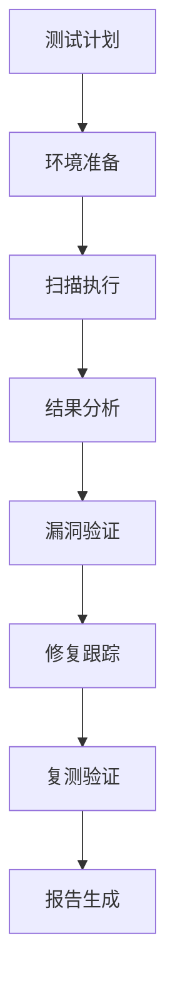

# 【Sprint 27+1】测试环境安全测试与漏洞扫描方案

## 1. 方案概述

### 1.1 目标
为AI-Ready测试环境设计全面的安全测试与漏洞扫描方案，确保测试环境具备完善的安全防护能力，识别和修复潜在安全漏洞，为测试团队提供安全可靠的测试基础设施。

### 1.2 背景
**Sprint 27+1: 测试环境配置专项** - 为测试团队明确测试环境配置需求，创建可执行的子任务，确保环境配置与Sprint 27目标对齐。

### 1.3 安全原则
- **纵深防御**：多层安全防护，防止单点突破
- **最小权限**：仅授予必要的访问权限
- **持续监控**：实时安全态势感知
- **快速响应**：及时发现和修复安全威胁

## 2. 安全测试策略设计

### 2.1 测试范围与目标

#### 2.1.1 测试覆盖范围
- **基础设施安全**：服务器、网络、存储设备
- **系统安全**：操作系统、中间件、数据库
- **应用安全**：Web应用、API接口、微服务
- **数据安全**：数据存储、传输、访问控制
- **管理安全**：身份认证、授权、审计日志

#### 2.1.2 安全测试目标
- **保密性**：防止未授权访问敏感信息
- **完整性**：防止未授权修改数据
- **可用性**：确保授权用户可正常访问
- **可追溯性**：所有操作可审计追踪

#### 2.1.3 风险评估矩阵
| 威胁类型 | 可能性 | 影响程度 | 风险等级 | 优先级 |
|---------|--------|----------|----------|--------|
| 未授权访问 | 高 | 高 | 高 | P1 |
| 数据泄露 | 中 | 高 | 高 | P1 |
| 服务拒绝 | 中 | 高 | 高 | P1 |
| 配置错误 | 高 | 中 | 中 | P2 |
| 权限提升 | 中 | 中 | 中 | P2 |
| 信息泄露 | 高 | 低 | 中 | P3 |

### 2.2 测试方法选择

#### 2.2.1 静态应用安全测试（SAST）
- **工具选型**：SonarQube, Checkmarx, Fortify
- **测试范围**：源代码、配置文件、脚本
- **检测类型**：代码注入、敏感信息泄露、不安全函数调用
- **集成时机**：开发阶段、代码提交时

#### 2.2.2 动态应用安全测试（DAST）
- **工具选型**：OWASP ZAP, Burp Suite, Acunetix
- **测试范围**：运行中的应用程序
- **检测类型**：SQL注入、XSS、CSRF、文件包含
- **集成时机**：测试环境部署后

#### 2.2.3 交互式应用安全测试（IAST）
- **工具选型**：Contrast Security, Synopsys Seeker
- **测试范围**：运行时应用程序
- **检测类型**：实时漏洞检测、运行时保护
- **集成时机**：应用程序运行时

#### 2.2.4 软件组成分析（SCA）
- **工具选型**：Snyk, WhiteSource, Dependency-Check
- **测试范围**：第三方库、开源组件
- **检测类型**：已知漏洞、许可证合规
- **集成时机**：构建时、定期扫描

## 3. 漏洞扫描方案设计

### 3.1 扫描工具选型

#### 3.1.1 综合扫描工具
```yaml
scanner_tools:
  - name: "Nessus"
    type: "comprehensive"
    coverage: ["network", "system", "web"]
    frequency: "weekly"
    criticality: "high"
    
  - name: "OpenVAS"
    type: "open_source"
    coverage: ["network", "system"]
    frequency: "biweekly"
    criticality: "medium"
    
  - name: "Nmap"
    type: "network_discovery"
    coverage: ["network"]
    frequency: "daily"
    criticality: "low"
```

#### 3.1.2 专项扫描工具
```yaml
specialized_scanners:
  - category: "web_application"
    tools: ["OWASP ZAP", "Burp Suite"]
    scan_focus: ["injection", "xss", "csrf"]
    
  - category: "container_security"
    tools: ["Trivy", "Clair", "Anchore"]
    scan_focus: ["image_vulnerabilities", "configuration"]
    
  - category: "cloud_security"
    tools: ["Prowler", "ScoutSuite"]
    scan_focus: ["misconfigurations", "compliance"]
```

### 3.2 扫描范围与频率

#### 3.2.1 扫描范围定义
```yaml
scan_scopes:
  - name: "full_scan"
    target: "all_assets"
    depth: "comprehensive"
    schedule: "monthly"
    
  - name: "incremental_scan"
    target: "changed_assets"
    depth: "targeted"
    schedule: "weekly"
    
  - name: "critical_scan"
    target: "critical_assets"
    depth: "deep"
    schedule: "daily"
```

#### 3.2.2 扫描频率策略
- **全量扫描**：每月一次，覆盖所有资产
- **增量扫描**：每周一次，关注变更资产
- **关键资产扫描**：每日一次，确保核心安全
- **事件触发扫描**：安全事件发生后立即执行

### 3.3 扫描自动化集成

#### 3.3.1 CI/CD集成
```yaml
ci_cd_integration:
  stages:
    - stage: "code_scan"
      tools: ["SAST", "SCA"]
      trigger: "on_commit"
      
    - stage: "build_scan"
      tools: ["container_scan"]
      trigger: "on_build"
      
    - stage: "deploy_scan"
      tools: ["DAST", "IAST"]
      trigger: "on_deploy"
```

#### 3.3.2 扫描结果处理
- **自动分类**：根据CVSS评分分类漏洞
- **优先级排序**：基于风险等级排序修复顺序
- **通知机制**：自动通知相关责任人
- **修复跟踪**：跟踪漏洞修复进度

## 4. 安全基线配置设计

### 4.1 操作系统安全基线

#### 4.1.1 Linux安全配置
```bash
# 用户与权限管理
useradd -m -s /bin/bash username
usermod -aG wheel username
passwd -l root

# SSH安全配置
sed -i 's/#PermitRootLogin yes/PermitRootLogin no/' /etc/ssh/sshd_config
sed -i 's/#PasswordAuthentication yes/PasswordAuthentication no/' /etc/ssh/sshd_config
systemctl restart sshd

# 防火墙配置
firewall-cmd --permanent --add-service=http
firewall-cmd --permanent --add-service=https
firewall-cmd --reload

# 系统加固
sysctl -w net.ipv4.tcp_syncookies=1
sysctl -w net.ipv4.conf.all.rp_filter=1
sysctl -w net.ipv4.conf.default.rp_filter=1
```

#### 4.1.2 Windows安全配置
```powershell
# 账户策略
net accounts /maxpwage:90
net accounts /minpwlen:12
net accounts /lockoutthreshold:5
net accounts /lockoutduration:30

# 服务安全
Set-Service -Name RemoteRegistry -StartupType Disabled
Set-Service -Name Telnet -StartupType Disabled
Set-Service -Name NetBIOS -StartupType Disabled

# 防火墙配置
New-NetFirewallRule -DisplayName "Allow HTTP" -Direction Inbound -Protocol TCP -LocalPort 80 -Action Allow
New-NetFirewallRule -DisplayName "Allow HTTPS" -Direction Inbound -Protocol TCP -LocalPort 443 -Action Allow
```

### 4.2 应用安全基线

#### 4.2.1 Web应用安全配置
```yaml
web_security:
  headers:
    - name: "X-Content-Type-Options"
      value: "nosniff"
    - name: "X-Frame-Options"
      value: "DENY"
    - name: "Content-Security-Policy"
      value: "default-src 'self'; script-src 'self' 'unsafe-inline'"
    - name: "Strict-Transport-Security"
      value: "max-age=31536000; includeSubDomains"
      
  session_management:
    session_timeout: 1800
    cookie_secure: true
    cookie_httponly: true
    cookie_samesite: "Strict"
```

#### 4.2.2 API安全配置
```yaml
api_security:
  authentication:
    method: "JWT"
    token_expiry: 3600
    refresh_token_expiry: 86400
    
  authorization:
    rbac_enabled: true
    roles: ["admin", "user", "guest"]
    permissions: ["read", "write", "delete"]
    
  rate_limiting:
    enabled: true
    requests_per_minute: 100
    burst_limit: 20
```

## 5. 安全测试执行与管理

### 5.1 测试执行流程

#### 5.1.1 标准化测试流程


#### 5.1.2 测试数据管理
- **测试用例库**：维护标准化的安全测试用例
- **测试数据集**：包含各种攻击payload的测试数据
- **环境快照**：测试前后环境状态记录
- **结果基准**：建立安全测试结果基准线

### 5.2 测试结果管理

#### 5.2.1 漏洞分类标准
```yaml
vulnerability_classification:
  critical:
    cvss_score: "9.0-10.0"
    examples: ["RCE", "SQLi", "XXE"]
    sla_fix: "24小时"
    
  high:
    cvss_score: "7.0-8.9"
    examples: ["XSS", "CSRF", "IDOR"]
    sla_fix: "72小时"
    
  medium:
    cvss_score: "4.0-6.9"
    examples: ["信息披露", "配置错误"]
    sla_fix: "7天"
    
  low:
    cvss_score: "0.1-3.9"
    examples: ["信息泄露", "低危配置"]
    sla_fix: "30天"
```

#### 5.2.2 报告生成机制
- **自动报告**：扫描完成后自动生成报告
- **定制化报告**：根据不同受众生成不同格式报告
- **趋势分析**：历史漏洞数据趋势分析
- **合规报告**：生成合规性审计报告

## 6. 安全监控与应急响应

### 6.1 安全监控设计

#### 6.1.1 监控指标体系
```yaml
security_metrics:
  - category: "access_control"
    metrics: ["failed_logins", "privilege_escalation", "unusual_access"]
    
  - category: "network_security"
    metrics: ["port_scans", "ddos_attacks", "malicious_traffic"]
    
  - category: "application_security"
    metrics: ["sql_injection", "xss_attempts", "file_inclusion"]
    
  - category: "data_security"
    metrics: ["data_leakage", "unauthorized_access", "encryption_failures"]
```

#### 6.1.2 安全事件检测
- **异常行为检测**：基于机器学习的异常检测
- **威胁情报集成**：实时威胁情报 feeds
- **合规性监控**：持续合规性检查
- **态势感知**：整体安全态势可视化

### 6.2 应急响应机制

#### 6.2.1 应急响应流程
```yaml
incident_response:
  stages:
    - stage: "准备阶段"
      activities: ["团队建设", "工具准备", "流程定义"]
      
    - stage: "检测分析"
      activities: ["事件发现", "初步分析", "影响评估"]
      
    - stage: "遏制根除"
      activities: ["隔离系统", "消除威胁", "恢复服务"]
      
    - stage: "恢复改进"
      activities: ["系统恢复", "事后分析", "改进措施"]
```

#### 6.2.2 演练计划
- **桌面演练**：每月一次，模拟安全事件
- **功能演练**：每季度一次，测试特定响应能力
- **全面演练**：每年一次，模拟真实安全事件
- **演练评估**：每次演练后进行评估和改进

## 7. 合规性与标准符合

### 7.1 安全标准符合

#### 7.1.1 行业标准映射
```yaml
compliance_framework:
  - name: "ISO 27001"
    controls: ["A.9.1", "A.9.2", "A.12.6", "A.14.2"]
    coverage: "95%"
    
  - name: "NIST CSF"
    categories: ["Identify", "Protect", "Detect", "Respond", "Recover"]
    coverage: "90%"
    
  - name: "GDPR"
    requirements: ["数据保护", "隐私设计", "数据主体权利"]
    coverage: "85%"
    
  - name: "PCI DSS"
    requirements: ["网络安全", "漏洞管理", "访问控制"]
    coverage: "80%"
```

#### 7.1.2 合规性检查
- **自动化检查**：自动化合规性验证工具
- **定期审计**：每季度一次合规性审计
- **合规报告**：生成合规性状态报告
- **持续改进**：基于审计结果的改进计划

### 7.2 最佳实践集成

#### 7.2.1 OWASP最佳实践
- **OWASP Top 10**：针对Top 10漏洞的防护措施
- **ASVS**：应用安全验证标准
- **SAMM**：软件保障成熟度模型
- **Cheat Sheets**：各种安全主题的速查表

#### 7.2.2 安全文化建设
- **安全培训**：定期的安全意识和技能培训
- **安全公告**：及时的安全威胁和防护措施公告
- **安全竞赛**：定期的安全技能竞赛
- **知识分享**：安全经验和最佳实践分享

## 8. 验收标准

### 8.1 安全测试验收
- [ ] 建立完整的安全测试策略和流程
- [ ] 实现SAST、DAST、IAST、SCA四种测试方法
- [ ] 安全测试覆盖率达到95%以上
- [ ] 安全测试自动化率达到80%以上

### 8.2 漏洞扫描验收
- [ ] 建立全面的漏洞扫描方案
- [ ] 扫描工具覆盖所有关键资产
- [ ] 扫描频率符合安全要求
- [ ] 漏洞修复率达到90%以上

### 8.3 安全基线验收
- [ ] 建立操作系统和应用安全基线
- [ ] 安全基线配置自动化率达到100%
- [ ] 基线符合性检查通过率达到95%
- [ ] 安全配置文档完整且更新及时

### 8.4 监控响应验收
- [ ] 建立全面的安全监控体系
- [ ] 安全事件检测平均时间<5分钟
- [ ] 应急响应平均时间<30分钟
- [ ] 安全演练完成率达到100%

## 9. 实施计划

### 9.1 第一阶段：基础建设（第1-2周）
1. 安全测试工具部署和配置
2. 漏洞扫描方案设计和实施
3. 安全基线配置标准制定

### 9.2 第二阶段：流程建立（第3-4周）
1. 安全测试流程标准化
2. 漏洞管理流程建立
3. 安全监控体系搭建

### 9.3 第三阶段：优化完善（第5-6周）
1. 安全自动化程度提升
2. 应急响应机制完善
3. 合规性检查体系建立

## 10. 附录

### 10.1 工具部署脚本
见附件：`scripts/deploy_security_tools.sh`

### 10.2 安全检查清单
见附件：`checklists/security_baseline_checklist.md`

### 10.3 应急响应手册
见附件：`handbooks/incident_response_handbook.md`

---

**文档版本**：v1.0  
**创建日期**：2026年5月5日  
**创建者**：test-agent-2  
**审核状态**：待审核