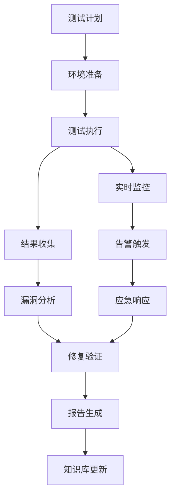

# 测试环境安全测试与漏洞扫描方案设计

## 1. 概述

### 1.1 项目背景
随着Sprint 27+1测试环境配置专项的推进，为确保测试环境的可靠性和安全性，需要建立全面的安全测试与漏洞扫描机制。本方案旨在为测试环境提供完整的安全防护体系，覆盖从基础架构到应用层的全方位安全测试。

### 1.2 设计目标
- **全面性**: 覆盖测试环境所有安全层面
- **自动化**: 实现安全测试的自动化执行和管理
- **实时性**: 建立实时监控和快速响应机制
- **合规性**: 符合行业安全标准和最佳实践
- **可扩展性**: 支持未来安全需求的扩展

### 1.3 设计原则
- **纵深防御**: 多层安全防护机制
- **最小权限**: 权限最小化原则
- **持续监控**: 7x24小时安全监控
- **快速响应**: 自动化应急响应机制
- **数据驱动**: 基于数据分析的安全决策

## 2. 安全测试策略设计

### 2.1 测试范围定义

#### 2.1.1 基础设施安全
- **操作系统安全**: Windows/Linux系统安全配置
- **网络安全**: 网络访问控制、防火墙规则
- **存储安全**: 数据存储加密、访问控制
- **虚拟化安全**: 虚拟化平台安全配置

#### 2.1.2 应用安全
- **Web应用安全**: OWASP Top 10漏洞防护
- **API安全**: API接口安全防护
- **数据库安全**: 数据库访问控制、SQL注入防护
- **中间件安全**: 中间件安全配置

#### 2.1.3 数据安全
- **数据加密**: 传输和存储加密
- **数据隔离**: 测试数据与生产数据隔离
- **数据脱敏**: 敏感数据脱敏处理
- **数据备份**: 安全备份和恢复机制

### 2.2 测试方法选择

#### 2.2.1 静态应用安全测试（SAST）
- **工具选型**: SonarQube + Checkmarx
- **测试范围**: 源代码安全漏洞检测
- **集成方式**: CI/CD流水线集成
- **测试频率**: 每次代码提交

#### 2.2.2 动态应用安全测试（DAST）
- **工具选型**: OWASP ZAP + Burp Suite
- **测试范围**: 运行时应用漏洞检测
- **集成方式**: 自动化扫描调度
- **测试频率**: 每日/每周定期扫描

#### 2.2.3 交互式应用安全测试（IAST）
- **工具选型**: Contrast Security
- **测试范围**: 运行时应用安全监控
- **集成方式**: 应用运行时插桩
- **测试频率**: 实时监控

#### 2.2.4 软件成分分析（SCA）
- **工具选型**: Snyk + Dependency-Check
- **测试范围**: 第三方组件漏洞检测
- **集成方式**: 构建时扫描
- **测试频率**: 每次构建

### 2.3 风险评估与优先级

#### 2.3.1 风险等级定义
- **高风险**: 可直接导致系统被入侵或数据泄露
- **中风险**: 可能被利用造成系统损害
- **低风险**: 安全弱点，但不易被利用

#### 2.3.2 优先级矩阵
| 风险等级 | 影响程度 | 修复优先级 | SLA要求 |
|---------|---------|-----------|--------|
| 高风险 | 严重 | P0（立即修复） | 24小时内 |
| 中风险 | 中等 | P1（计划修复） | 7天内 |
| 低风险 | 轻微 | P2（优化修复） | 30天内 |

#### 2.3.3 风险评分模型
```
风险评分 = 可能性 × 影响程度 × 暴露程度
可能性：1-5分（低到高）
影响程度：1-5分（轻微到严重）
暴露程度：1-5分（内部到公开）
```

## 3. 漏洞扫描方案设计

### 3.1 扫描工具选型

#### 3.1.1 基础设施扫描工具
- **Nessus**: 综合性漏洞扫描
- **OpenVAS**: 开源漏洞扫描器
- **Qualys**: 云端漏洞管理平台
- **Tenable.io**: 企业级漏洞管理

#### 3.1.2 应用扫描工具
- **OWASP ZAP**: Web应用安全扫描
- **Burp Suite**: 专业Web安全测试
- **Acunetix**: 自动化Web漏洞扫描
- **Netsparker**: 企业级Web安全扫描

#### 3.1.3 容器安全扫描
- **Trivy**: 容器镜像漏洞扫描
- **Clair**: 容器漏洞静态分析
- **Anchore**: 容器安全合规性扫描
- **Snyk Container**: 容器安全扫描

#### 3.1.4 配置扫描工具
- **CIS-CAT**: CIS基准配置扫描
- **OpenSCAP**: 安全配置评估
- **Inspec**: 基础设施合规性测试
- **Chef InSpec**: 自动化合规检查

### 3.2 扫描策略设计

#### 3.2.1 扫描频率
- **实时扫描**: 关键系统7x24小时监控
- **每日扫描**: 核心应用和基础设施
- **每周扫描**: 全面系统漏洞扫描
- **月度扫描**: 深度安全评估

#### 3.2.2 扫描范围
```
├── 基础设施层
│   ├── 网络设备
│   ├── 服务器
│   ├── 存储设备
│   └── 虚拟化平台
├── 平台层
│   ├── 操作系统
│   ├── 数据库
│   ├── 中间件
│   └── 容器平台
├── 应用层
│   ├── Web应用
│   ├── API接口
│   ├── 移动应用
│   └── 微服务
└── 数据层
    ├── 数据存储
    ├── 数据传输
    ├── 数据备份
    └── 数据销毁
```

#### 3.2.3 扫描深度
- **基础扫描**: 端口扫描、服务识别
- **标准扫描**: 漏洞检测、配置检查
- **深度扫描**: 渗透测试、权限提升
- **专项扫描**: 特定漏洞类型检测

### 3.3 自动化扫描集成

#### 3.3.1 CI/CD流水线集成
```yaml
stages:
  - build
  - test
  - security_scan
  - deploy

security_scan:
  stage: security_scan
  script:
    - sonar-scanner # SAST扫描
    - zap-baseline-scan # DAST扫描
    - trivy image # 容器扫描
    - dependency-check # SCA扫描
  artifacts:
    reports:
      security: gl-sast-report.json
      dependency_scanning: gl-dependency-scanning-report.json
```

#### 3.3.2 定时扫描调度
```python
# 扫描调度器配置
scan_schedule = {
    "daily_scans": {
        "time": "02:00",
        "targets": ["critical_apps", "core_infra"],
        "type": "standard"
    },
    "weekly_scans": {
        "time": "周日 03:00",
        "targets": ["all_systems"],
        "type": "comprehensive"
    },
    "monthly_scans": {
        "time": "每月1日 04:00",
        "targets": ["all_systems"],
        "type": "deep_dive"
    }
}
```

#### 3.3.3 增量扫描优化
- **变更驱动扫描**: 仅扫描变更部分
- **智能扫描调度**: 基于风险等级的扫描频率调整
- **并行扫描**: 多目标并行扫描提升效率
- **结果缓存**: 避免重复扫描

### 3.4 扫描结果管理

#### 3.4.1 结果收集
- **标准化格式**: SARIF、CycloneDX、SPDX
- **集中存储**: 安全漏洞数据库
- **实时同步**: 扫描结果实时入库
- **去重处理**: 避免重复漏洞记录

#### 3.4.2 结果验证
- **自动验证**: 自动化验证脚本
- **人工验证**: 高风险漏洞人工确认
- **误报处理**: 误报标记和排除
- **验证流程**: 标准化验证流程

#### 3.4.3 结果分析
- **趋势分析**: 漏洞趋势统计
- **根因分析**: 漏洞产生原因分析
- **影响评估**: 漏洞影响范围评估
- **修复建议**: 自动化修复建议生成

## 4. 安全基线配置设计

### 4.1 操作系统安全基线

#### 4.1.1 Windows安全基线
```powershell
# Windows安全配置基线
$security_policy = @{
    "AccountPolicies" = @{
        "PasswordPolicy" = @{
            "MinimumPasswordLength" = 12
            "PasswordComplexity" = $true
            "PasswordHistorySize" = 24
            "MaximumPasswordAge" = 90
        }
        "AccountLockoutPolicy" = @{
            "AccountLockoutDuration" = 30
            "AccountLockoutThreshold" = 5
            "ResetAccountLockoutCounter" = 30
        }
    }
    "SecurityOptions" = @{
        "InteractiveLogon" = @{
            "MessageText" = "授权访问系统"
            "MessageTitle" = "安全警告"
        }
    }
}
```

#### 4.1.2 Linux安全基线
```bash
# Linux安全配置基线
# 1. 用户和权限管理
useradd -m -s /bin/bash -G wheel username
passwd -l root
chmod 750 /root

# 2. SSH安全配置
echo "PermitRootLogin no" >> /etc/ssh/sshd_config
echo "PasswordAuthentication no" >> /etc/ssh/sshd_config
echo "PubkeyAuthentication yes" >> /etc/ssh/sshd_config

# 3. 防火墙配置
ufw default deny incoming
ufw default allow outgoing
ufw allow 22/tcp
ufw enable

# 4. 系统审计配置
apt-get install auditd
systemctl enable auditd
systemctl start auditd
```

### 4.2 应用安全基线

#### 4.2.1 Web应用安全配置
```yaml
# Web应用安全配置
security:
  headers:
    X-Frame-Options: DENY
    X-Content-Type-Options: nosniff
    X-XSS-Protection: "1; mode=block"
    Strict-Transport-Security: "max-age=31536000; includeSubDomains"
  csrf:
    enabled: true
    token: true
  cors:
    allowed-origins: ["https://example.com"]
    allowed-methods: ["GET", "POST"]
    allowed-headers: ["*"]
  session:
    secure: true
    httpOnly: true
    sameSite: Strict
```

#### 4.2.2 API安全配置
```json
{
  "api_security": {
    "authentication": {
      "type": "JWT",
      "token_expiry": "1h",
      "refresh_token_expiry": "7d"
    },
    "authorization": {
      "rbac_enabled": true,
      "permission_model": "role_based"
    },
    "rate_limiting": {
      "enabled": true,
      "requests_per_minute": 100,
      "burst_limit": 20
    },
    "input_validation": {
      "enabled": true,
      "schema_validation": true,
      "max_payload_size": "10MB"
    }
  }
}
```

#### 4.2.3 数据库安全配置
```sql
-- 数据库安全配置
-- 1. 用户权限管理
CREATE USER 'app_user'@'localhost' IDENTIFIED BY 'strong_password';
GRANT SELECT, INSERT, UPDATE, DELETE ON app_db.* TO 'app_user'@'localhost';
REVOKE ALL PRIVILEGES ON *.* FROM 'app_user'@'localhost';

-- 2. 数据加密配置
CREATE TABLE sensitive_data (
    id INT PRIMARY KEY,
    encrypted_data VARBINARY(255),
    encryption_key_id VARCHAR(50)
);

-- 3. 审计日志配置
SET GLOBAL audit_log = ON;
SET GLOBAL audit_log_format = JSON;
SET GLOBAL audit_log_policy = ALL;
```

### 4.3 网络安全基线

#### 4.3.1 网络访问控制
```yaml
# 网络ACL配置
network_acls:
  inbound_rules:
    - description: "SSH访问"
      protocol: "tcp"
      port: 22
      source: "10.0.0.0/16"
      action: "allow"
    - description: "HTTP访问"
      protocol: "tcp"
      port: 80
      source: "0.0.0.0/0"
      action: "allow"
    - description: "HTTPS访问"
      protocol: "tcp"
      port: 443
      source: "0.0.0.0/0"
      action: "allow"
    - description: "默认拒绝"
      protocol: "all"
      port: "all"
      source: "0.0.0.0/0"
      action: "deny"
  outbound_rules:
    - description: "允许所有出站"
      protocol: "all"
      port: "all"
      destination: "0.0.0.0/0"
      action: "allow"
```

#### 4.3.2 防火墙规则
```bash
# iptables防火墙配置
# 清除现有规则
iptables -F
iptables -X

# 设置默认策略
iptables -P INPUT DROP
iptables -P FORWARD DROP
iptables -P OUTPUT ACCEPT

# 允许本地回环
iptables -A INPUT -i lo -j ACCEPT
iptables -A OUTPUT -o lo -j ACCEPT

# 允许已建立的连接
iptables -A INPUT -m state --state ESTABLISHED,RELATED -j ACCEPT

# 允许SSH访问
iptables -A INPUT -p tcp --dport 22 -j ACCEPT

# 允许HTTP/HTTPS访问
iptables -A INPUT -p tcp --dport 80 -j ACCEPT
iptables -A INPUT -p tcp --dport 443 -j ACCEPT

# 记录被拒绝的包
iptables -A INPUT -j LOG --log-prefix "IPTABLES-DROPPED: "
```

### 4.4 容器安全基线

#### 4.4.1 容器运行时安全
```dockerfile
# Docker安全配置
FROM alpine:3.14

# 使用非root用户
RUN addgroup -g 1000 -S appgroup && \
    adduser -u 1000 -S appuser -G appgroup

# 最小化镜像
RUN apk add --no-cache python3 py3-pip

# 设置工作目录
WORKDIR /app

# 复制应用文件
COPY --chown=appuser:appgroup . .

# 切换到非root用户
USER appuser

# 暴露端口
EXPOSE 8080

# 健康检查
HEALTHCHECK --interval=30s --timeout=3s --start-period=5s --retries=3 \
  CMD curl -f http://localhost:8080/health || exit 1

# 启动命令
CMD ["python3", "app.py"]
```

#### 4.4.2 Kubernetes安全配置
```yaml
# Kubernetes安全策略
apiVersion: policy/v1beta1
kind: PodSecurityPolicy
metadata:
  name: restricted
spec:
  privileged: false
  allowPrivilegeEscalation: false
  requiredDropCapabilities:
    - ALL
  volumes:
    - 'configMap'
    - 'emptyDir'
    - 'projected'
    - 'secret'
    - 'downwardAPI'
    - 'persistentVolumeClaim'
  hostNetwork: false
  hostIPC: false
  hostPID: false
  runAsUser:
    rule: 'MustRunAsNonRoot'
  seLinux:
    rule: 'RunAsAny'
  supplementalGroups:
    rule: 'MustRunAs'
    ranges:
      - min: 1
        max: 65535
  fsGroup:
    rule: 'MustRunAs'
    ranges:
      - min: 1
        max: 65535
  readOnlyRootFilesystem: false
```

## 5. 安全测试执行与管理

### 5.1 测试执行流程

#### 5.1.1 标准化测试流程


#### 5.1.2 测试环境准备
```python
# 测试环境准备脚本
def prepare_test_environment(env_config):
    """准备安全测试环境"""
    
    # 1. 环境检查
    check_prerequisites()
    
    # 2. 环境配置
    configure_network(env_config['network'])
    configure_firewall(env_config['firewall'])
    configure_monitoring(env_config['monitoring'])
    
    # 3. 工具部署
    deploy_scanner_tools(env_config['tools'])
    deploy_monitoring_agents(env_config['agents'])
    
    # 4. 数据准备
    prepare_test_data(env_config['test_data'])
    prepare_credentials(env_config['credentials'])
    
    # 5. 环境验证
    validate_environment()
    
    return {
        'status': 'ready',
        'tools_installed': env_config['tools'],
        'monitoring_active': True,
        'data_ready': True
    }
```

#### 5.1.3 测试数据管理
```yaml
# 测试数据管理配置
test_data_management:
  generation:
    synthetic_data: true
    data_masking: true
    volume: "10GB"
    variety: ["structured", "unstructured", "semi-structured"]
  
  storage:
    encryption: true
    access_control: true
    retention_policy: "30days"
    backup_frequency: "daily"
  
  lifecycle:
    creation: "on-demand"
    usage: "single-use"
    disposal: "secure-delete"
    audit: "full-trace"
```

### 5.2 自动化测试框架

#### 5.2.1 测试框架架构
```python
# 安全测试自动化框架
class SecurityTestFramework:
    def __init__(self):
        self.scanners = {
            'sast': SASTScanner(),
            'dast': DASTScanner(),
            'sca': SCAScanner(),
            'container': ContainerScanner(),
            'infra': InfraScanner()
        }
        self.reporters = {
            'console': ConsoleReporter(),
            'html': HTMLReporter(),
            'json': JSONReporter(),
            'jira': JiraReporter()
        }
        self.schedulers = {
            'immediate': ImmediateScheduler(),
            'scheduled': ScheduledScheduler(),
            'event': EventDrivenScheduler()
        }
    
    def run_test_suite(self, test_suite, target):
        """运行测试套件"""
        results = {}
        
        for test_type in test_suite:
            scanner = self.scanners.get(test_type)
            if scanner:
                results[test_type] = scanner.scan(target)
        
        return self.aggregate_results(results)
    
    def schedule_test(self, test_config):
        """调度测试任务"""
        scheduler = self.schedulers.get(test_config['schedule_type'])
        if scheduler:
            return scheduler.schedule(test_config)
        
        return None
```

#### 5.2.2 测试用例管理
```python
# 测试用例管理
class TestCaseManager:
    def __init__(self):
        self.test_cases = self.load_test_cases()
        self.test_suites = self.load_test_suites()
    
    def load_test_cases(self):
        """加载测试用例"""
        return {
            'owasp_top_10': self.load_owasp_test_cases(),
            'cwe_top_25': self.load_cwe_test_cases(),
            'cis_benchmarks': self.load_cis_test_cases(),
            'custom_tests': self.load_custom_test_cases()
        }
    
    def create_test_suite(self, target_type, risk_level):
        """创建测试套件"""
        suite = []
        
        # 基础测试用例
        suite.extend(self.test_cases['owasp_top_10']['critical'])
        
        # 根据目标类型添加特定测试
        if target_type == 'web_app':
            suite.extend(self.test_cases['owasp_top_10']['web_specific'])
        elif target_type == 'api':
            suite.extend(self.test_cases['owasp_top_10']['api_specific'])
        
        # 根据风险等级调整测试深度
        if risk_level == 'high':
            suite.extend(self.test_cases['cwe_top_25']['high_risk'])
            suite.extend(self.test_cases['cis_benchmarks']['strict'])
        
        return suite
    
    def execute_test_suite(self, suite, target):
        """执行测试套件"""
        results = []
        
        for test_case in suite:
            result = self.execute_test_case(test_case, target)
            results.append({
                'test_case': test_case['id'],
                'result': result['status'],
                'details': result['details'],
                'timestamp': datetime.now()
            })
        
        return results
```

### 5.3 测试结果管理

#### 5.3.1 结果收集与存储
```python
# 测试结果管理
class TestResultManager:
    def __init__(self):
        self.db_client = DatabaseClient()
        self.storage_client = StorageClient()
    
    def store_results(self, results):
        """存储测试结果"""
        # 1. 标准化结果格式
        standardized_results = self.standardize_results(results)
        
        # 2. 存储到数据库
        db_result = self.db_client.store(standardized_results)
        
        # 3. 生成报告文件
        report_files = self.generate_reports(standardized_results)
        
        # 4. 存储到文件系统
        for report in report_files:
            self.storage_client.upload(report)
        
        return {
            'db_id': db_result['id'],
            'report_urls': [r['url'] for r in report_files],
            'timestamp': datetime.now()
        }
    
    def standardize_results(self, results):
        """标准化结果格式"""
        standardized = []
        
        for result in results:
            standardized.append({
                'vulnerability_id': result.get('id'),
                'title': result.get('title'),
                'description': result.get('description'),
                'severity': self.normalize_severity(result.get('severity')),
                'cvss_score': result.get('cvss_score'),
                'cwe_id': result.get('cwe_id'),
                'owasp_category': result.get('owasp_category'),
                'location': result.get('location'),
                'evidence': result.get('evidence'),
                'recommendation': result.get('recommendation'),
                'scanner': result.get('scanner'),
                'scan_timestamp': result.get('timestamp'),
                'target': result.get('target')
            })
        
        return standardized
```

#### 5.3.2 漏洞分类与优先级
```python
# 漏洞优先级管理
class VulnerabilityPrioritizer:
    def __init__(self):
        self.priority_rules = self.load_priority_rules()
    
    def calculate_priority(self, vulnerability):
        """计算漏洞优先级"""
        score = 0
        
        # CVSS评分权重
        cvss_score = vulnerability.get('cvss_score', 0)
        score += cvss_score * 0.4
        
        # 业务影响权重
        business_impact = self.assess_business_impact(vulnerability)
        score += business_impact * 0.3
        
        # 利用难度权重
        exploitability = self.assess_exploitability(vulnerability)
        score += exploitability * 0.2
        
        # 资产重要性权重
        asset_value = self.assess_asset_value(vulnerability['target'])
        score += asset_value * 0.1
        
        # 确定优先级等级
        if score >= 8.0:
            return {'priority': 'P0', 'sla': '24h', 'score': score}
        elif score >= 6.0:
            return {'priority': 'P1', 'sla': '7d', 'score': score}
        elif score >= 4.0:
            return {'priority': 'P2', 'sla': '30d', 'score': score}
        else:
            return {'priority': 'P3', 'sla': '90d', 'score': score}
    
    def assess_business_impact(self, vulnerability):
        """评估业务影响"""
        impact_factors = {
            'data_breach': 10,
            'service_outage': 8,
            'data_corruption': 7,
            'unauthorized_access': 6,
            'information_disclosure': 5
        }
        
        impact = 0
        for factor, weight in impact_factors.items():
            if vulnerability.get(factor, False):
                impact += weight
        
        return min(impact / 10, 10)
```

#### 5.3.3 修复跟踪与管理
```python
# 修复跟踪管理
class RemediationTracker:
    def __init__(self):
        self.tracking_db = TrackingDatabase()
    
    def create_remediation_ticket(self, vulnerability):
        """创建修复工单"""
        ticket = {
            'ticket_id': self.generate_ticket_id(),
            'vulnerability_id': vulnerability['id'],
            'title': f"修复漏洞: {vulnerability['title']}",
            'description': vulnerability['description'],
            'severity': vulnerability['severity'],
            'priority': vulnerability['priority'],
            'assignee': self.assign_remediation_owner(vulnerability),
            'due_date': self.calculate_due_date(vulnerability['priority']),
            'status': 'open',
            'created_at': datetime.now(),
            'updated_at': datetime.now()
        }
        
        self.tracking_db.create_ticket(ticket)
        return ticket
    
    def track_remediation_progress(self, ticket_id):
        """跟踪修复进度"""
        ticket = self.tracking_db.get_ticket(ticket_id)
        
        progress = {
            'ticket_id': ticket_id,
            'current_status': ticket['status'],
            'days_open': (datetime.now() - ticket['created_at']).days,
            'days_remaining': self.calculate_days_remaining(ticket),
            'progress_percentage': self.calculate_progress(ticket),
            'blockers': self.identify_blockers(ticket),
            'next_steps': self.suggest_next_steps(ticket)
        }
        
        return progress
    
    def verify_remediation(self, ticket_id, verification_data):
        """验证修复结果"""
        ticket = self.tracking_db.get_ticket(ticket_id)
        
        # 执行验证测试
        verification_result = self.execute_verification_test(
            ticket['vulnerability_id'],
            verification_data
        )
        
        if verification_result['success']:
            ticket['status'] = 'verified'
            ticket['verified_at'] = datetime.now()
            ticket['verifier'] = verification_data['verifier']
            self.tracking_db.update_ticket(ticket)
            
            return {
                'success': True,
                'message': '漏洞修复验证通过',
                'verification_details': verification_result
            }
        else:
            return {
                'success': False,
                'message': '漏洞修复验证失败',
                'verification_details': verification_result,
                'next_actions': ['重新修复', '调整验证方法']
            }
```

## 6. 安全监控与应急响应

### 6.1 安全监控体系

#### 6.1.1 监控架构设计
```yaml
# 安全监控架构
security_monitoring:
  data_collection:
    agents:
      - type: "ossec"
        platforms: ["linux", "windows"]
        capabilities: ["log_analysis", "file_integrity", "rootkit_detection"]
      - type: "wazuh"
        platforms: ["linux", "windows", "macos"]
        capabilities: ["siem", "vulnerability_detection", "compliance"]
      - type: "elastic_agent"
        platforms: ["all"]
        capabilities: ["metrics", "logs", "traces"]
  
  data_processing:
    pipeline:
      - stage: "normalization"
        processors: ["log_parser", "field_extractor", "enricher"]
      - stage: "correlation"
        processors: ["rule_engine", "anomaly_detector"]
      - stage: "alerting"
        processors: ["threshold_checker", "pattern_matcher"]
  
  storage:
    hot_storage:
      type: "elasticsearch"
      retention: "7d"
      indices: ["security-alerts-*", "security-events-*"]
    cold_storage:
      type: "s3"
      retention: "365d"
      prefix: "security-archive/"
  
  visualization:
    dashboards:
      - name: "security_overview"
        panels: ["threat_map", "alert_timeline", "top_threats", "vulnerability_trend"]
      - name: "incident_response"
        panels: ["incident_timeline", "response_actions", "remediation_status", "mttr_metrics"]
```

#### 6.1.2 实时威胁检测
```python
# 实时威胁检测引擎
class ThreatDetectionEngine:
    def __init__(self):
        self.rules_engine = RulesEngine()
        self.ml_engine = MLEngine()
        self.behavior_engine = BehaviorEngine()
    
    def detect_threats(self, event_stream):
        """检测安全威胁"""
        threats = []
        
        # 基于规则的检测
        rule_based_threats = self.rules_engine.detect(event_stream)
        threats.extend(rule_based_threats)
        
        # 基于机器学习的检测
        ml_based_threats = self.ml_engine.detect(event_stream)
        threats.extend(ml_based_threats)
        
        # 基于行为的检测
        behavior_based_threats = self.behavior_engine.detect(event_stream)
        threats.extend(behavior_based_threats)
        
        # 威胁聚合和去重
        aggregated_threats = self.aggregate_threats(threats)
        
        return aggregated_threats
    
    def aggregate_threats(self, threats):
        """聚合和去重威胁"""
        aggregated = {}
        
        for threat in threats:
            key = f"{threat['type']}-{threat['source']}-{threat['target']}"
            
            if key not in aggregated:
                aggregated[key] = {
                    'type': threat['type'],
                    'source': threat['source'],
                    'target': threat['target'],
                    'first_seen': threat['timestamp'],
                    'last_seen': threat['timestamp'],
                    'count': 1,
                    'severity': threat['severity'],
                    'details': [threat['details']]
                }
            else:
                aggregated[key]['last_seen'] = threat['timestamp']
                aggregated[key]['count'] += 1
                aggregated[key]['details'].append(threat['details'])
                # 更新最高严重度
                if threat['severity'] > aggregated[key]['severity']:
                    aggregated[key]['severity'] = threat['severity']
        
        return list(aggregated.values())
```

#### 6.1.3 安全事件告警
```python
# 安全事件告警系统
class SecurityAlertSystem:
    def __init__(self):
        self.notification_channels = {
            'email': EmailNotifier(),
            'slack': SlackNotifier(),
            'teams': TeamsNotifier(),
            'sms': SMSNotifier(),
            'phone': PhoneNotifier()
        }
        self.escalation_policies = self.load_escalation_policies()
    
    def send_alert(self, threat, alert_config):
        """发送安全告警"""
        alert = self.create_alert(threat, alert_config)
        
        # 根据严重度选择通知渠道
        channels = self.select_notification_channels(alert['severity'])
        
        # 发送通知
        notifications_sent = []
        for channel in channels:
            notifier = self.notification_channels.get(channel)
            if notifier:
                result = notifier.send(alert)
                notifications_sent.append({
                    'channel': channel,
                    'success': result['success'],
                    'message_id': result.get('message_id')
                })
        
        # 记录告警
        self.log_alert(alert, notifications_sent)
        
        return {
            'alert_id': alert['id'],
            'threat': threat,
            'notifications': notifications_sent,
            'timestamp': datetime.now()
        }
    
    def create_alert(self, threat, config):
        """创建告警"""
        return {
            'id': str(uuid.uuid4()),
            'title': self.generate_alert_title(threat),
            'description': self.generate_alert_description(threat),
            'severity': threat['severity'],
            'urgency': self.calculate_urgency(threat),
            'category': threat['type'],
            'source': threat['source'],
            'target': threat['target'],
            'timestamp': datetime.now(),
            'details': threat['details'],
            'recommended_actions': self.generate_recommended_actions(threat),
            'acknowledgement_required': config.get('acknowledgement_required', True),
            'escalation_policy': config.get('escalation_policy', 'default')
        }
    
    def select_notification_channels(self, severity):
        """选择通知渠道"""
        if severity >= 9:  # 严重
            return ['phone', 'sms', 'slack', 'email']
        elif severity >= 7:  # 高
            return ['sms', 'slack', 'email']
        elif severity >= 5:  # 中
            return ['slack', 'email']
        else:  # 低
            return ['email']
```

### 6.2 应急响应机制

#### 6.2.1 应急响应流程
```python
# 应急响应流程管理器
class IncidentResponseManager:
    def __init__(self):
        self.response_playbooks = self.load_response_playbooks()
        self.response_team = self.load_response_team()
    
    def handle_incident(self, incident):
        """处理安全事件"""
        # 1. 事件分类和优先级评估
        classified_incident = self.classify_incident(incident)
        
        # 2. 启动应急响应
        response = self.initiate_response(classified_incident)
        
        # 3. 执行响应剧本
        playbook = self.select_playbook(classified_incident['type'])
        execution_results = self.execute_playbook(playbook, incident)
        
        # 4. 恢复和修复
        recovery_results = self.execute_recovery(incident)
        
        # 5. 事后分析和改进
        lessons_learned = self.conduct_post_mortem(incident, response, recovery_results)
        
        return {
            'incident_id': incident['id'],
            'response_id': response['id'],
            'classification': classified_incident,
            'playbook_executed': playbook['name'],
            'recovery_results': recovery_results,
            'lessons_learned': lessons_learned,
            'status': 'resolved',
            '