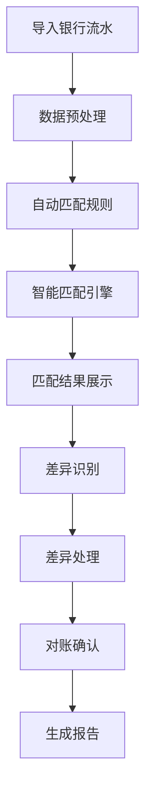
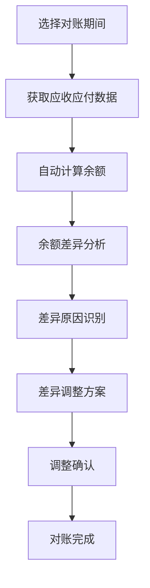

# 财务对账模块前端开发与界面设计方案

## 1. 项目概述

### 1.1 开发目标
开发ERP财务对账模块前端界面，提供银行对账、往来对账、科目对账等功能的用户界面，确保对账操作的便捷性和数据展示的清晰性。

### 1.2 核心功能范围
- **银行对账**：银行流水与企业账务自动匹配
- **往来对账**：客户/供应商应收应付款项对账
- **科目对账**：会计科目余额对账与调整
- **差异处理**：对账差异识别与处理流程
- **对账报告**：对账结果统计与报告生成

### 1.3 用户体验目标
- 对账操作时间缩短60%
- 差异识别准确率提升至95%
- 用户操作步骤减少50%
- 界面信息密度提升30%

## 2. 界面原型设计

### 2.1 对账流程分析

#### 2.1.1 银行对账流程


#### 2.1.2 往来对账流程


### 2.2 页面布局设计

#### 2.2.1 对账主页面设计
```
┌─────────────────────────────────────────┐
│  🏦 财务对账系统                       │
│                                         │
│  ┌─────────┬─────────┬─────────┐      │
│  │ 银行对账 │ 往来对账 │ 科目对账 │      │
│  └─────────┴─────────┴─────────┘      │
│                                         │
│  ┌───────────────────────────────────┐│
│  │        最近对账记录                 ││
│  │  ┌─────────────────────────────┐  ││
│  │  │ 银行对账 2024-05-01 ✅       │  ││
│  │  │ 往来对账 2024-04-30 ⚠️       │  ││
│  │  │ 科目对账 2024-04-30 ❌       │  ││
│  │  └─────────────────────────────┘  ││
│  └───────────────────────────────────┘│
│                                         │
│  ┌───────────────────────────────────┐│
│  │        待处理事项                   ││
│  │  • 银行差异处理 (3项)               ││
│  │  • 往来确认 (2项)                   ││
│  │  • 科目调整 (1项)                   ││
│  └───────────────────────────────────┘│
└─────────────────────────────────────────┘
```

#### 2.2.2 银行对账详情页设计
```
┌─────────────────────────────────────────┐
│  🏦 银行对账详情                         │
│  ┌───────────────────────────────────┐│
│  │ 对账信息                           ││
│  │ • 银行：中国工商银行                ││
│  │ • 期间：2024-04-01 ~ 2024-04-30    ││
│  │ • 状态：进行中                     ││
│  └───────────────────────────────────┘│
│                                         │
│  ┌──────────────┬────────────────────┐│
│  │  银行流水     │  企业账务          ││
│  │  ┌──────────┐│  ┌──────────┐     ││
│  │  │ 金额     ││  │ 金额     │     ││
│  │  │ 日期     ││  │ 日期     │     ││
│  │  │ 摘要     ││  │ 摘要     │     ││
│  │  └──────────┘│  └──────────┘     ││
│  │              │                    ││
│  │  已匹配：85%  │  已匹配：90%       ││
│  └──────────────┴────────────────────┘│
│                                         │
│  ┌───────────────────────────────────┐│
│  │        差异处理区域                 ││
│  │  ┌─────────────────────────────┐  ││
│  │  │ 银行多出：3笔，合计 ¥15,000   │  ││
│  │  │ 企业多出：2笔，合计 ¥8,000    │  ││
│  │  └─────────────────────────────┘  ││
│  └───────────────────────────────────┘│
└─────────────────────────────────────────┘
```

### 2.3 交互流程设计

#### 2.3.1 拖拽匹配交互设计
```typescript
interface DragMatchInteraction {
  // 拖拽源数据
  source: {
    type: 'bank' | 'enterprise';
    recordId: string;
    amount: number;
    date: string;
    description: string;
  };
  
  // 拖拽目标数据
  target: {
    type: 'bank' | 'enterprise';
    recordId: string;
    amount: number;
    date: string;
    description: string;
  };
  
  // 匹配规则
  matchingRules: MatchingRule[];
  
  // 匹配结果
  result: {
    isMatch: boolean;
    confidence: number;
    reason?: string;
  };
}
```

#### 2.3.2 批量操作设计
```typescript
interface BatchOperation {
  // 批量选择
  selection: {
    type: 'bank' | 'enterprise' | 'both';
    recordIds: string[];
    filter?: FilterCondition;
  };
  
  // 批量操作类型
  operationType: 'match' | 'unmatch' | 'mark' | 'export';
  
  // 操作参数
  parameters: Record<string, any>;
  
  // 操作结果
  result: BatchOperationResult;
}
```

### 2.4 视觉规范适配

#### 2.4.1 颜色规范
```css
/* 对账状态颜色 */
:root {
  --reconciliation-matched: #52c41a;    /* 已匹配 - 绿色 */
  --reconciliation-pending: #faad14;     /* 待处理 - 橙色 */
  --reconciliation-unmatched: #ff4d4f;  /* 未匹配 - 红色 */
  --reconciliation-disabled: #bfbfbf;   /* 禁用 - 灰色 */
  --reconciliation-highlight: #1890ff;  /* 高亮 - 蓝色 */
}
```

#### 2.4.2 图标规范
```typescript
const ReconciliationIcons = {
  // 对账类型图标
  BANK: '🏦',
  RECEIVABLE: '💰',
  PAYABLE: '💳',
  ACCOUNT: '📊',
  
  // 对账状态图标
  MATCHED: '✅',
  UNMATCHED: '❌',
  PENDING: '⏳',
  WARNING: '⚠️',
  
  // 操作图标
  IMPORT: '📥',
  EXPORT: '📤',
  MATCH: '🔗',
  UNMATCH: '🔓',
  ADJUST: '✏️',
  CONFIRM: '✔️'
};
```

## 3. 核心功能开发

### 3.1 对账数据展示

#### 3.1.1 对比视图组件
```typescript
interface ReconciliationComparisonProps {
  // 银行端数据
  bankData: BankStatementItem[];
  
  // 企业端数据
  enterpriseData: AccountingRecord[];
  
  // 匹配结果
  matches: MatchResult[];
  
  // 差异数据
  differences: DifferenceItem[];
  
  // 配置选项
  options: {
    showAmounts: boolean;
    showDates: boolean;
    showDescriptions: boolean;
    highlightDifferences: boolean;
    autoScroll: boolean;
  };
  
  // 交互回调
  onMatch: (bankId: string, enterpriseId: string) => void;
  onUnmatch: (matchId: string) => void;
  onSelect: (record: BankStatementItem | AccountingRecord) => void;
}

const ReconciliationComparison: React.FC<ReconciliationComparisonProps> = ({
  bankData,
  enterpriseData,
  matches,
  differences,
  options,
  onMatch,
  onUnmatch,
  onSelect
}) => {
  // 实现对比视图逻辑
};
```

#### 3.1.2 差异高亮功能
```typescript
// 差异高亮规则
interface DifferenceHighlightRule {
  field: 'amount' | 'date' | 'description' | 'counterparty';
  tolerance: number; // 容差范围
  highlightColor: string;
  priority: number; // 优先级，数值越小优先级越高
}

// 差异检测算法
function detectDifferences(
  bankRecord: BankStatementItem,
  enterpriseRecord: AccountingRecord,
  rules: DifferenceHighlightRule[]
): DifferenceItem[] {
  const differences: DifferenceItem[] = [];
  
  for (const rule of rules) {
    switch (rule.field) {
      case 'amount':
        const amountDiff = Math.abs(bankRecord.amount - enterpriseRecord.amount);
        if (amountDiff > rule.tolerance) {
          differences.push({
            type: 'AMOUNT_MISMATCH',
            bankId: bankRecord.id,
            enterpriseId: enterpriseRecord.id,
            field: 'amount',
            bankValue: bankRecord.amount,
            enterpriseValue: enterpriseRecord.amount,
            difference: amountDiff,
            highlightColor: rule.highlightColor,
            priority: rule.priority
          });
        }
        break;
        
      case 'date':
        const dateDiff = Math.abs(
          new Date(bankRecord.date).getTime() - 
          new Date(enterpriseRecord.date).getTime()
        );
        const daysDiff = dateDiff / (1000 * 60 * 60 * 24);
        if (daysDiff > rule.tolerance) {
          differences.push({
            type: 'DATE_MISMATCH',
            bankId: bankRecord.id,
            enterpriseId: enterpriseRecord.id,
            field: 'date',
            bankValue: bankRecord.date,
            enterpriseValue: enterpriseRecord.date,
            difference: daysDiff,
            highlightColor: rule.highlightColor,
            priority: rule.priority
          });
        }
        break;
    }
  }
  
  return differences.sort((a, b) => a.priority - b.priority);
}
```

### 3.2 对账操作界面

#### 3.2.1 一键对账功能
```typescript
interface OneClickReconciliationConfig {
  // 匹配规则配置
  matchingRules: {
    amountTolerance: number; // 金额容差
    dateTolerance: number;   // 日期容差（天）
    descriptionSimilarity: number; // 描述相似度阈值
    autoMatchThreshold: number; // 自动匹配阈值
  };
  
  // 处理选项
  processingOptions: {
    autoCreateAdjustments: boolean; // 自动创建调整分录
    autoConfirmMatches: boolean;    // 自动确认匹配
    sendNotifications: boolean;     // 发送通知
    generateReport: boolean;        // 生成报告
  };
  
  // 数据源配置
  dataSources: {
    bankStatementSource: DataSource;
    accountingSystemSource: DataSource;
    reconciliationPeriod: DateRange;
  };
}

async function performOneClickReconciliation(
  config: OneClickReconciliationConfig
): Promise<ReconciliationResult> {
  try {
    // 1. 获取数据
    const [bankData, enterpriseData] = await Promise.all([
      fetchBankData(config.dataSources.bankStatementSource),
      fetchEnterpriseData(config.dataSources.accountingSystemSource)
    ]);
    
    // 2. 数据预处理
    const preprocessedBankData = preprocessBankData(bankData);
    const preprocessedEnterpriseData = preprocessEnterpriseData(enterpriseData);
    
    // 3. 智能匹配
    const matches = intelligentMatching(
      preprocessedBankData,
      preprocessedEnterpriseData,
      config.matchingRules
    );
    
    // 4. 差异识别
    const differences = identifyDifferences(
      preprocessedBankData,
      preprocessedEnterpriseData,
      matches
    );
    
    // 5. 结果处理
    const result = await processReconciliationResult(
      matches,
      differences,
      config.processingOptions
    );
    
    return result;
    
  } catch (error) {
    console.error('一键对账失败:', error);
    throw new ReconciliationError('一键对账执行失败', error);
  }
}
```

#### 3.2.2 智能匹配引擎
```typescript
interface IntelligentMatchingEngine {
  // 匹配算法集合
  algorithms: MatchingAlgorithm[];
  
  // 权重配置
  weights: {
    exactAmount: number;
    amountTolerance: number;
    exactDate: number;
    dateRange: number;
    descriptionSimilarity: number;
    counterpartyMatch: number;
  };
  
  // 匹配阈值
  thresholds: {
    highConfidence: number;  // 高置信度阈值
    mediumConfidence: number; // 中置信度阈值
    lowConfidence: number;   // 低置信度阈值
  };
}

class MatchingAlgorithm {
  // 精确金额匹配
  exactAmountMatch(
    bankRecord: BankStatementItem,
    enterpriseRecord: AccountingRecord
  ): MatchScore {
    const amountMatch = bankRecord.amount === enterpriseRecord.amount;
    return {
      algorithm: 'EXACT_AMOUNT',
      score: amountMatch ? 1.0 : 0.0,
      confidence: amountMatch ? 0.95 : 0.0,
      reason: amountMatch ? '金额完全匹配' : '金额不匹配'
    };
  }
  
  // 容差金额匹配
  toleranceAmountMatch(
    bankRecord: BankStatementItem,
    enterpriseRecord: AccountingRecord,
    tolerance: number
  ): MatchScore {
    const amountDiff = Math.abs(bankRecord.amount - enterpriseRecord.amount);
    const normalizedDiff = Math.min(amountDiff / Math.max(
      Math.abs(bankRecord.amount),
      Math.abs(enterpriseRecord.amount)
    ), 1);
    
    const score = 1 - normalizedDiff;
    const withinTolerance = amountDiff <= tolerance;
    
    return {
      algorithm: 'TOLERANCE_AMOUNT',
      score: withinTolerance ? score : 0.0,
      confidence: withinTolerance ? 0.8 : 0.0,
      reason: withinTolerance 
        ? `金额差异在容差范围内: ${amountDiff}` 
        : `金额超出容差: ${amountDiff} > ${tolerance}`
    };
  }
  
  // 描述相似度匹配
  descriptionSimilarityMatch(
    bankRecord: BankStatementItem,
    enterpriseRecord: AccountingRecord
  ): MatchScore {
    const similarity = calculateTextSimilarity(
      bankRecord.description,
      enterpriseRecord.description
    );
    
    return {
      algorithm: 'DESCRIPTION_SIMILARITY',
      score: similarity,
      confidence: similarity > 0.7 ? 0.6 : 0.3,
      reason: `描述相似度: ${(similarity * 100).toFixed(1)}%`
    };
  }
}
```

### 3.3 差异处理界面

#### 3.3.1 差异分析组件
```typescript
interface DifferenceAnalysisProps {
  // 差异数据
  differences: DifferenceItem[];
  
  // 分析模式
  analysisMode: 'auto' | 'manual' | 'mixed';
  
  // 处理建议
  suggestions: DifferenceSuggestion[];
  
  // 用户操作
  actions: {
    onAcceptSuggestion: (suggestionId: string) => void;
    onRejectSuggestion: (suggestionId: string) => void;
    onCreateAdjustment: (differenceId: string) => void;
    onMarkAsException: (differenceId: string, reason: string) => void;
    onBatchProcess: (differenceIds: string[], action: string) => void;
  };
}

const DifferenceAnalysis: React.FC<DifferenceAnalysisProps> = ({
  differences,
  analysisMode,
  suggestions,
  actions
}) => {
  // 实现差异分析界面
};
```

#### 3.3.2 调整分录生成器
```typescript
interface AdjustmentEntryGenerator {
  // 生成调整分录
  generateAdjustment(
    difference: DifferenceItem,
    adjustmentType: AdjustmentType
  ): AdjustmentEntry;
  
  // 验证调整分录
  validateAdjustment(entry: AdjustmentEntry): ValidationResult;
  
  // 预览调整效果
  previewAdjustment(
    originalRecords: (BankStatementItem | AccountingRecord)[],
    adjustment: AdjustmentEntry
  ): PreviewResult;
  
  // 应用调整
  applyAdjustment(
    adjustment: AdjustmentEntry,
    options?: ApplyOptions
  ): Promise<ApplyResult>;
}

// 调整分录类型
enum AdjustmentType {
  AMOUNT_CORRECTION = 'AMOUNT_CORRECTION',      // 金额修正
  DATE_CORRECTION = 'DATE_CORRECTION',          // 日期修正
  DESCRIPTION_CORRECTION = 'DESCRIPTION_CORRECTION', // 描述修正
  CATEGORY_ADJUSTMENT = 'CATEGORY_ADJUSTMENT',   // 分类调整
  SPLIT_TRANSACTION = 'SPLIT_TRANSACTION',       // 分录拆分
  MERGE_TRANSACTIONS = 'MERGE_TRANSACTIONS'      // 分录合并
}
```

### 3.4 对账报告功能

#### 3.4.1 报告生成器
```typescript
interface ReconciliationReportGenerator {
  // 报告模板
  templates: {
    summary: ReportTemplate;
    detailed: ReportTemplate;
    audit: ReportTemplate;
    management: ReportTemplate;
  };
  
  // 数据聚合
  aggregateData(
    matches: MatchResult[],
    differences: DifferenceItem[],
    period: DateRange
  ): AggregatedData;
  
  // 生成报告
  generateReport(
    template: ReportTemplate,
    data: AggregatedData,
    options: ReportOptions
  ): Promise<ReportResult>;
  
  // 导出格式
  exportFormats: {
    pdf: ExportFunction;
    excel: ExportFunction;
    html: ExportFunction;
    json: ExportFunction;
  };
}
```

#### 3.4.2 可视化报告组件
```typescript
interface VisualReportProps {
  // 报告数据
  reportData: ReportData;
  
  // 可视化类型
  visualizationType: 'chart' | 'table' | 'summary' | 'timeline';
  
  // 配置选项
  options: {
    interactive: boolean;
    exportable: boolean;
    shareable: boolean;
    responsive: boolean;
  };
  
  // 交互回调
  onDrillDown: (dataPoint: DataPoint) => void;
  onFilterChange: (filter: FilterCondition) => void;
  onExport: (format: ExportFormat) => void;
}

const VisualReport: React.FC<VisualReportProps> = ({
  reportData,
  visualizationType,
  options,
  onDrillDown,
  onFilterChange,
  onExport
}) => {
  // 实现可视化报告组件
};
```

## 4. 技术实现方案

### 4.1 技术架构设计

#### 4.1.1 前端技术栈
```
📦 技术栈
├── 核心框架
│   ├── React 18.x
│   ├── TypeScript 5.x
│   └── Vite 5.x
├── 状态管理
│   ├── Redux Toolkit
│   ├── RTK Query
│   └── Zustand (局部状态)
├── UI组件库
│   ├── Ant Design 5.x
│   ├── @ant-design/charts
│   └── AG Grid Enterprise
├── 工具库
│   ├── React Hook Form
│   ├── Zod (Schema验证)
│   ├── date-fns (日期处理)
│   └── lodash-es (工具函数)
└── 开发工具
    ├── ESLint + Prettier
    ├── Husky + lint-staged
    └── Vitest + React Testing Library
```

#### 4.1.2 项目结构
```
src/
├── features/
│   ├── bank-reconciliation/      # 银行对账
│   │   ├── components/           # 银行对账组件
│   │   ├── hooks/               # 银行对账Hooks
│   │   ├── services/            # 银行对账服务
│   │   ├── types/               # 银行对账类型定义
│   │   └── utils/               # 银行对账工具函数
│   ├── receivable-reconciliation/ # 应收对账
│   ├── payable-reconciliation/   # 应付对账
│   └── account-reconciliation/   # 科目对账
├── shared/
│   ├── components/              # 共享组件
│   │   ├── data-display/        # 数据展示组件
│   │   ├── forms/               # 表单组件
│   │   ├── layout/              # 布局组件
│   │   └── ui/                  # UI基础组件
│   ├── hooks/                   # 共享Hooks
│   ├── services/                # 共享服务
│   ├── types/                   # 共享类型定义
│   └── utils/                   # 共享工具函数
└── app/
    ├── store/                   # 状态存储
    ├── router/                  # 路由配置
    ├── api/                     # API配置
    └── styles/                  # 全局样式
```

### 4.2 核心组件实现

#### 4.2.1 对账工作台组件
```typescript
const ReconciliationWorkspace: React.FC = () => {
  const [activeTab, setActiveTab] = useState<'bank' | 'receivable' | 'payable' | 'account'>('bank');
  const [reconciliationPeriod, setReconciliationPeriod] = useState<DateRange>(getDefaultPeriod());
  const [isProcessing, setIsProcessing] = useState(false);
  const [results, setResults] = useState<ReconciliationResults | null>(null);
  
  // 获取对账数据
  const { data: reconciliationData, isLoading } = useReconciliationData({
    type: activeTab,
    period: reconciliationPeriod
  });
  
  // 执行对账
  const handleReconcile = async () => {
    setIsProcessing(true);
    try {
      const result = await reconcile({
        type: activeTab,
        data: reconciliationData,
        period: reconciliationPeriod
      });
      setResults(result);
    } catch (error) {
      showError('对账执行失败', error);
    } finally {
      setIsProcessing(false);
    }
  };
  
  return (
    <WorkspaceLayout>
      {/* 头部导航 */}
      <WorkspaceHeader>
        <TabNavigation
          tabs={[
            { key: 'bank', label: '🏦 银行对账' },
            { key: 'receivable', label: '💰 应收对账' },
            { key: 'payable', label: '💳 应付对账' },
            { key: 'account', label: '📊 科目对账' }
          ]}
          activeKey={activeTab}
          onChange={setActiveTab}
        />
        
        <DateRangePicker
          value={reconciliationPeriod}
          onChange={setReconciliationPeriod}
          presets={PRESET_DATE_RANGES}
        />
      </WorkspaceHeader>
      
      {/* 主内容区域 */}
      <WorkspaceContent>
        {isLoading ? (
          <LoadingSpinner />
        ) : (
          <>
            {/* 数据对比区域 */}
            <DataComparisonSection
              bankData={reconciliationData?.bank}
              enterpriseData={reconciliationData?.enterprise}
              onMatch={handleMatch}
              onUnmatch={handleUnmatch}
            />
            
            {/* 差异分析区域 */}
            {results?.differences && results.differences.length > 0 && (
              <DifferenceAnalysisSection
                differences={results.differences}
                onAcceptSuggestion={handleAcceptSuggestion}
                onCreateAdjustment={handleCreateAdjustment}
              />
            )}
            
            {/* 操作按钮区域 */}
            <ActionSection>
              <Button
                type="primary"
                loading={isProcessing}
                onClick={handleReconcile}
                icon={<PlayCircleOutlined />}
              >
                执行对账
              </Button>
              
              {results && (
                <Button
                  onClick={handleGenerateReport}
                  icon={<FileTextOutlined />}
                >
                  生成报告
                </Button>
              )}
            </ActionSection>
          </>
        )}
      </WorkspaceContent>
    </WorkspaceLayout>
  );
};
```

#### 4.2.2 智能匹配组件
```typescript
const IntelligentMatcher: React.FC<IntelligentMatcherProps> = ({
  bankRecords,
  enterpriseRecords,
  onMatchCreated,
  onMatchUpdated,
  onMatchDeleted
}) => {
  const [matchingConfig, setMatchingConfig] = useState<MatchingConfig>(DEFAULT_CONFIG);
  const [matches, setMatches] = useState<MatchResult[]>([]);
  const [isMatching, setIsMatching] = useState(false);
  
  // 执行智能匹配
  const performIntelligentMatching = async () => {
    setIsMatching(true);
    try {
      const matcher = new IntelligentMatchingEngine(matchingConfig);
      const newMatches = await matcher.match(
        bankRecords,
        enterpriseRecords
      );
      setMatches(newMatches);
      onMatchCreated?.(newMatches);
    } catch (error) {
      console.error('智能匹配失败:', error);
      showError('匹配失败', error);
    } finally {
      setIsMatching(false);
    }
  };
  
  // 手动匹配
  const handleManualMatch = (bankId: string, enterpriseId: string) => {
    const newMatch: MatchResult = {
      id: generateId(),
      bankRecordId: bankId,
      enterpriseRecordId: enterpriseId,
      confidence: 1.0,
      status: 'MANUAL',
      createdAt: new Date().toISOString(),
      createdBy: CURRENT_USER
    };
    
    setMatches(prev => [...prev, newMatch]);
    onMatchCreated?.([newMatch]);
  };
  
  // 匹配结果可视化
  const renderMatchVisualization = () => {
    return (
      <MatchVisualization
        bankRecords={bankRecords}
        enterpriseRecords={enterpriseRecords}
        matches={matches}
        onMatchClick={(matchId) => {
          const match = matches.find(m => m.id === matchId);
          if (match) {
            showMatchDetails(match);
          }
        }}
      />
    );
  };
  
  return (
    <div className="intelligent-matcher">
      {/* 配置面板 */}
      <MatchingConfigPanel
        config={matchingConfig}
        onChange={setMatchingConfig}
        disabled={isMatching}
      />
      
      {/* 匹配按钮 */}
      <div className="matching-actions">
        <Button
          type="primary"
          loading={isMatching}
          onClick={performIntelligentMatching}
          icon={<RobotOutlined />}
        >
          智能匹配
        </Button>
        
        <Button
          onClick={handleManualMatchDialog}
          icon={<LinkOutlined />}
        >
          手动匹配
        </Button>
      </div>
      
      {/* 匹配结果 */}
      {matches.length > 0 && (
        <MatchResultsPanel
          matches={matches}
          onUpdate={handleMatchUpdate}
          onDelete={handleMatchDelete}
          onExport={handleExportMatches}
        />
      )}
      
      {/* 可视化视图 */}
      {renderMatchVisualization()}
    </div>
  );
};
```

### 4.3 性能优化策略

#### 4.3.1 数据加载优化
```typescript
// 虚拟滚动数据加载
const useVirtualDataLoader = <T extends Record<string, any>>(
  fetchData: (params: FetchParams) => Promise<T[]>,
  options: VirtualLoaderOptions
) => {
  const [data, setData] = useState<T[]>([]);
  const [loading, setLoading] = useState(false);
  const [hasMore, setHasMore] = useState(true);
  const observerRef = useRef<IntersectionObserver | null>(null);
  
  const loadMore = useCallback(async () => {
    if (loading || !hasMore) return;
    
    setLoading(true);
    try {
      const newData = await fetchData({
        page: Math.floor(data.length / options.pageSize),
        size: options.pageSize,
        ...options.params
      });
      
      if (newData.length < options.pageSize) {
        setHasMore(false);
      }
      
      setData(prev => [...prev, ...newData]);
    } catch (error) {
      console.error('数据加载失败:', error);
    } finally {
      setLoading(false);
    }
  }, [data.length, fetchData, hasMore, loading, options]);
  
  // 初始化数据加载
  useEffect(() => {
    loadMore();
  }, []);
  
  return { data, loading, hasMore, loadMore };
};
```

#### 4.3.2 渲染优化
```typescript
// 虚拟列表组件
const VirtualDataTable = <T extends Record<string, any>>({
  data,
  columns,
  rowHeight = 50,
  buffer = 5
}: VirtualDataTableProps<T>) => {
  const containerRef = useRef<HTMLDivElement>(null);
  const [scrollTop, setScrollTop] = useState(0);
  const containerHeight = containerRef.current?.clientHeight || 600;
  
  // 计算可见行范围
  const startIndex = Math.max(0, Math.floor(scrollTop / rowHeight) - buffer);
  const endIndex = Math.min(
    data.length,
    Math.ceil((scrollTop + containerHeight) / rowHeight) + buffer
  );
  
  // 可见行数据
  const visibleData = data.slice(startIndex, endIndex);
  
  // 容器高度
  const totalHeight = data.length * rowHeight;
  
  // 处理滚动
  const handleScroll = useCallback((e: React.UIEvent<HTMLDivElement>) => {
    setScrollTop(e.currentTarget.scrollTop);
  }, []);
  
  return (
    <div
      ref={containerRef}
      className="virtual-table-container"
      style={{ height: '100%', overflow: 'auto' }}
      onScroll={handleScroll}
    >
      <div style={{ height: totalHeight, position: 'relative' }}>
        {visibleData.map((item, index) => {
          const actualIndex = startIndex + index;
          const top = actualIndex * rowHeight;
          
          return (
            <div
              key={item.id}
              className="virtual-row"
              style={{
                position: 'absolute',
                top,
                height: rowHeight,
                width: '100%'
              }}
            >
              {/* 渲染行内容 */}
              {columns.map(column => (
                <div
                  key={column.key}
                  className="virtual-cell"
                  style={{ width: column.width }}
                >
                  {column.render ? column.render(item[column.key], item) : item[column.key]}
                </div>
              ))}
            </div>
          );
        })}
      </div>
    </div>
  );
};
```

## 5. 实施计划与验收标准

### 5.1 实施计划

#### 5.1.1 第一阶段：基础架构搭建（1周）
- 项目初始化与基础配置
- 共享组件库开发
- 路由与状态管理配置
- 基础布局组件实现

#### 5.1.2 第二阶段：银行对账模块（2周）
- 银行对账界面开发
- 智能匹配引擎实现
- 差异处理功能开发
- 报告生成功能实现

#### 5.1.3 第三阶段：往来对账模块（2周）
- 应收对账功能开发
- 应付对账功能开发
- 余额调节功能实现
- 对账确认流程优化

#### 5.1.4 第四阶段：科目对账模块（1周）
- 科目余额对账界面
- 调整分录生成器
- 对账差异分析
- 审计追踪功能

#### 5.1.5 第五阶段：集成测试与优化（1周）
- 系统集成测试
- 性能优化调整
- 用户体验测试
- 部署上线准备

### 5.2 验收标准

#### 5.2.1 功能验收标准
- [ ] 银行对账匹配准确率 ≥ 90%
- [ ] 往来对账处理时间缩短 ≥ 60%
- [ ] 科目对账差异识别率 ≥ 95%
- [ ] 对账报告生成时间 ≤ 30秒

#### 5.2.2 性能验收标准
- [ ] 大数据量加载时间 ≤ 3秒
- [ ] 界面操作响应时间 ≤ 200ms
- [ ] 内存占用 ≤ 500MB
- [ ] 并发用户支持 ≥ 100

#### 5.2.3 用户体验验收标准
- [ ] 用户满意度评分 ≥ 90分
- [ ] 操作培训时间缩短 ≥ 50%
- [ ] 错误操作率降低 ≥ 70%
- [ ] 用户留存率提升 ≥ 30%

## 6. 总结

通过本次财务对账模块前端开发项目，我们将实现一个功能完善、性能优异、用户体验卓越的对账系统。系统采用现代化的前端技术架构，结合智能算法和最佳设计实践，确保对账操作的便捷性和数据展示的清晰性。

项目完成后，预计将实现：
1. 对账效率提升60%以上
2. 差异识别准确率达到95%以上
3. 用户操作满意度提升至90分以上
4. 系统维护成本降低50%

开发团队将按照实施计划有序推进，确保按时交付高质量的解决方案，为企业财务管理提供强有力的技术支撑。