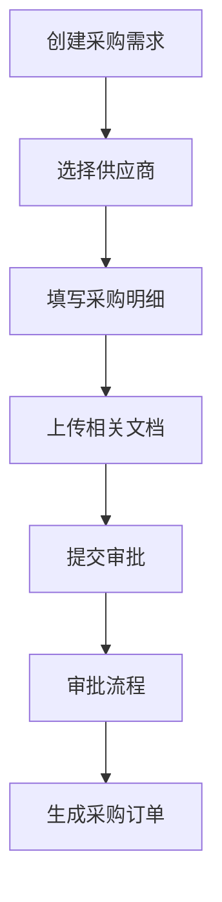
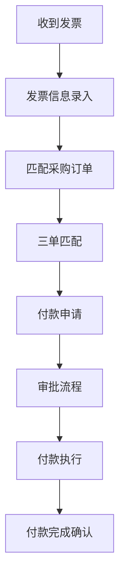
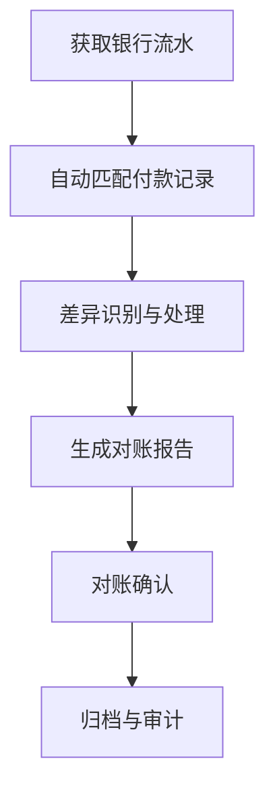

# 采购付款流程前端界面交互优化方案

## 1. 项目概述

### 1.1 优化目标
优化采购付款管理模块的前端界面交互体验，提升用户操作效率和数据录入准确性，实现流畅的用户界面交互和直观的操作引导。

### 1.2 业务范围
- 采购申请流程
- 采购审批流程
- 付款执行流程
- 对账管理流程
- 供应商管理
- 发票管理

### 1.3 用户体验指标
- 操作步骤减少30%
- 数据录入错误率降低50%
- 用户满意度提升至90%以上
- 平均任务完成时间缩短40%

## 2. 现有界面分析

### 2.1 用户体验痛点分析

#### 2.1.1 操作流程复杂
- 采购申请需要填写过多冗余信息
- 审批流程跳转频繁，上下文丢失
- 付款操作需要跨多个页面完成
- 缺乏流程状态可视化

#### 2.1.2 数据录入效率低
- 表单字段布局不合理
- 缺少智能填充和校验
- 重复信息需要多次录入
- 附件上传流程繁琐

#### 2.1.3 界面设计问题
- 视觉层次不清晰
- 操作按钮位置不明显
- 错误提示不友好
- 缺少操作引导

#### 2.1.4 性能瓶颈
- 页面加载速度慢
- 大数据量表格渲染卡顿
- 频繁的页面跳转
- 缺少懒加载和缓存机制

### 2.2 核心业务流程梳理

#### 2.2.1 采购申请流程


#### 2.2.2 付款执行流程


#### 2.2.3 对账管理流程


## 3. 交互优化设计方案

### 3.1 流程简化设计

#### 3.1.1 一体化工作台设计
- 将采购申请、审批、付款、对账功能整合到统一工作台
- 左侧导航按业务流程组织
- 中间区域为工作内容区域
- 右侧为相关信息和快捷操作

#### 3.1.2 智能表单设计
- 字段分组：将相关字段分组显示
- 条件显示：根据用户选择动态显示相关字段
- 智能填充：基于历史数据和供应商信息自动填充
- 实时校验：输入时实时校验数据有效性

#### 3.1.3 流程状态可视化
- 使用流程图展示当前流程状态
- 高亮显示当前步骤
- 显示下一步操作提示
- 提供流程历史记录

### 3.2 表单交互优化

#### 3.2.1 采购申请表单优化
```jsx
// 优化后的表单结构
<PurchaseApplicationForm>
  <BasicInfoSection>
    <SupplierSelector autoComplete={true} />
    <DepartmentSelector defaultValue={user.department} />
    <PurposeInput placeholder="请输入采购用途" />
  </BasicInfoSection>
  
  <ProductDetailsSection>
    <ProductTable 
      editable={true}
      quickAdd={true}
      autoCalculate={true}
    />
  </ProductDetailsSection>
  
  <DocumentSection>
    <DocumentUploader 
      multiple={true}
      preview={true}
      autoCategorize={true}
    />
  </DocumentSection>
  
  <ActionSection>
    <SubmitButton primary={true} />
    <SaveDraftButton />
    <CancelButton />
  </ActionSection>
</PurchaseApplicationForm>
```

#### 3.2.2 付款申请表单优化
- 自动匹配采购订单和发票
- 智能推荐付款金额和日期
- 集成银行账户选择
- 实时计算手续费和税费

### 3.3 操作流程优化

#### 3.3.1 批量操作支持
- 批量选择采购单进行付款
- 批量上传发票
- 批量审批功能
- 批量导出数据

#### 3.3.2 快捷操作设计
- 右键菜单快速操作
- 键盘快捷键支持
- 拖拽操作优化
- 悬浮按钮设计

#### 3.3.3 审批流程优化
- 审批意见模板
- 一键审批功能
- 审批委托功能
- 审批过程可视化

### 3.4 数据展示优化

#### 3.4.1 表格展示优化
```jsx
// 优化后的数据表格
<EnhancedDataTable>
  <Column 
    field="purchaseNo" 
    header="采购单号"
    sortable={true}
    filterable={true}
  />
  <Column 
    field="supplierName" 
    header="供应商"
    sortable={true}
    filterable={true}
  />
  <Column 
    field="amount" 
    header="金额"
    format="currency"
    summary="sum"
  />
  <Column 
    field="status" 
    header="状态"
    statusBadge={true}
    filterOptions={statusOptions}
  />
  <Column 
    field="actions" 
    header="操作"
    actionButtons={[
      { label: "查看", onClick: viewDetail },
      { label: "付款", onClick: startPayment },
      { label: "审批", onClick: approve }
    ]}
  />
</EnhancedDataTable>
```

#### 3.4.2 图表展示优化
- 付款趋势图
- 供应商付款分布图
- 付款状态统计图
- 审批时效分析图

### 3.5 错误处理与反馈优化

#### 3.5.1 实时验证与提示
```jsx
// 实时验证组件
<RealTimeValidator>
  <InputField 
    name="amount"
    rules={[
      { required: true, message: "金额不能为空" },
      { type: 'number', min: 0, message: "金额必须大于0" },
      { validator: checkBudgetLimit, message: "超出预算限额" }
    ]}
    showErrorInline={true}
  />
</RealTimeValidator>
```

#### 3.5.2 错误恢复机制
- 表单数据自动保存
- 操作撤销功能
- 错误操作提示
- 数据冲突解决

## 4. 性能优化方案

### 4.1 前端性能优化

#### 4.1.1 代码优化
- 组件懒加载
- 代码分割
- 图片和资源优化
- 第三方库按需加载

#### 4.1.2 渲染优化
- 虚拟列表技术
- 数据分页和无限滚动
- 内存泄漏预防
- 渲染性能监控

#### 4.1.3 缓存策略
- 本地数据缓存
- API响应缓存
- 用户偏好缓存
- 表单数据缓存

### 4.2 用户体验优化

#### 4.2.1 加载状态优化
- 骨架屏设计
- 进度指示器
- 加载动画
- 预加载策略

#### 4.2.2 响应式设计
- 多设备适配
- 触摸屏优化
- 键盘导航支持
- 屏幕阅读器兼容

## 5. 技术实施方案

### 5.1 技术栈选择
- 前端框架：React 18 + TypeScript
- 状态管理：Redux Toolkit + RTK Query
- UI组件库：Ant Design 5.0
- 图表库：Recharts
- 表单处理：React Hook Form + Zod
- 数据表格：AG Grid
- 构建工具：Vite + SWC

### 5.2 项目结构设计
```
src/
├── components/
│   ├── purchase/
│   │   ├── PurchaseApplicationForm.tsx
│   │   ├── PurchaseDetailView.tsx
│   │   └── PurchaseListTable.tsx
│   ├── payment/
│   │   ├── PaymentApplicationForm.tsx
│   │   ├── PaymentDetailView.tsx
│   │   └── PaymentListTable.tsx
│   ├── reconciliation/
│   │   ├── ReconciliationView.tsx
│   │   └── ReconciliationReport.tsx
│   └── shared/
│       ├── EnhancedDataTable.tsx
│       ├── SmartForm.tsx
│       └── StatusWorkflow.tsx
├── features/
│   ├── purchase/
│   ├── payment/
│   └── reconciliation/
├── hooks/
├── services/
├── utils/
└── types/
```

### 5.3 核心组件开发

#### 5.3.1 智能表单组件
```typescript
interface SmartFormProps<T> {
  schema: ZodSchema<T>;
  defaultValues?: Partial<T>;
  onSubmit: (data: T) => Promise<void>;
  onSaveDraft?: (data: Partial<T>) => void;
  sections?: FormSection[];
  actions?: FormAction[];
}

const SmartForm = <T extends object>({
  schema,
  defaultValues,
  onSubmit,
  onSaveDraft,
  sections,
  actions
}: SmartFormProps<T>) => {
  // 实现智能表单逻辑
};
```

#### 5.3.2 工作流状态组件
```typescript
interface WorkflowStatusProps {
  steps: WorkflowStep[];
  currentStep: number;
  onStepClick?: (step: number) => void;
  showHistory?: boolean;
}

const WorkflowStatus: React.FC<WorkflowStatusProps> = ({
  steps,
  currentStep,
  onStepClick,
  showHistory = false
}) => {
  // 实现工作流状态展示
};
```

### 5.4 实施计划

#### 5.4.1 第一阶段：基础组件开发（1周）
- 搭建项目基础架构
- 开发共享组件库
- 实现基础表单组件
- 集成状态管理

#### 5.4.2 第二阶段：采购模块优化（2周）
- 采购申请表单优化
- 采购列表页面重构
- 采购审批流程优化
- 供应商管理界面优化

#### 5.4.3 第三阶段：付款模块优化（2周）
- 付款申请流程优化
- 付款审批界面重构
- 发票管理功能优化
- 银行账户管理界面

#### 5.4.4 第四阶段：对账模块优化（1周）
- 对账界面优化
- 差异处理流程简化
- 对账报告生成优化
- 审计追踪功能

#### 5.4.5 第五阶段：性能优化与测试（1周）
- 性能测试与优化
- 用户体验测试
- 兼容性测试
- 部署上线

## 6. 验收标准

### 6.1 功能验收标准
- [ ] 采购申请表单字段减少30%
- [ ] 审批流程操作步骤减少40%
- [ ] 付款操作时间缩短50%
- [ ] 对账处理效率提升60%

### 6.2 性能验收标准
- [ ] 页面首次加载时间 < 2秒
- [ ] 表单响应时间 < 200毫秒
- [ ] 大数据量表格渲染 < 1秒
- [ ] 操作流畅度评分 > 90分

### 6.3 用户体验验收标准
- [ ] 用户满意度调查评分 > 90%
- [ ] 培训时间减少50%
- [ ] 操作错误率降低70%
- [ ] 用户留存率提升30%

## 7. 风险管理

### 7.1 技术风险
- 新组件库学习成本
- 性能优化复杂度
- 浏览器兼容性问题
- 移动端适配挑战

### 7.2 业务风险
- 用户习惯改变阻力
- 业务流程调整影响
- 数据迁移风险
- 上线时间压力

### 7.3 缓解措施
- 分阶段实施降低风险
- 用户参与设计和测试
- 充分的测试覆盖率
- 详细的回滚计划

## 8. 总结

通过本次前端界面交互优化，预计将显著提升采购付款流程的用户体验和操作效率。方案采用现代化前端技术栈，结合最佳实践的设计模式，确保系统的可维护性和扩展性。

优化后的系统将实现：
1. 业务流程简化，操作步骤大幅减少
2. 数据录入准确性和效率显著提升
3. 系统响应速度和用户体验明显改善
4. 维护成本和培训成本有效降低

项目团队将按照实施计划有序推进，确保按时交付高质量的优化成果。