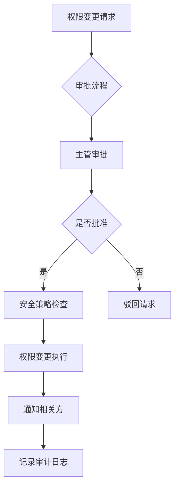

# ERP系统权限控制方案设计

## 1. 权限控制体系概述

### 1.1 设计目标
建立精细化、动态化、多层次的数据访问控制体系，实现基于角色、数据、字段的多维度权限管理。

### 1.2 设计原则
- **最小权限原则**：用户只拥有完成工作所需的最小权限
- **职责分离**：关键操作需要多人协作完成
- **动态调整**：支持运行时权限变更
- **审计追踪**：所有权限变更可追溯
- **继承与覆盖**：支持多层级权限继承和特定覆盖

## 2. 角色权限矩阵设计

### 2.1 角色定义模型
```yaml
Role Hierarchy:
  组织级角色 (Organization Role)
    ├── 系统管理员 (System Admin)
    ├── 安全管理员 (Security Admin)
    ├── 审计管理员 (Audit Admin)
    │
  业务级角色 (Business Role)
    ├── 总经理 (General Manager)
    ├── 部门经理 (Department Manager)
    ├── 项目经理 (Project Manager)
    │
  操作级角色 (Operational Role)
    ├── 财务专员 (Finance Specialist)
    ├── 采购专员 (Procurement Specialist)
    ├── 销售专员 (Sales Specialist)
    ├── 库存管理员 (Inventory Manager)
```

### 2.2 权限矩阵示例
| 功能模块 | 系统管理员 | 部门经理 | 财务专员 | 采购专员 | 销售专员 |
|---------|-----------|---------|---------|---------|---------|
| 用户管理 | CRUD | R | - | - | - |
| 权限管理 | CRUD | - | - | - | - |
| 财务管理 | CRU | CRU | CRU | R | R |
| 采购管理 | CRU | CRU | R | CRUD | R |
| 销售管理 | CRU | CRU | R | R | CRUD |
| 库存管理 | CRU | CRU | R | RU | RU |
| 报表管理 | CRU | CRU | CR | R | CR |

**权限标识说明**：C=创建，R=读取，U=更新，D=删除

### 2.3 权限粒度设计
```json
{
  "module": "采购管理",
  "permissions": [
    {
      "resource": "采购订单",
      "operations": ["create", "read", "update", "delete", "approve", "reject"],
      "data_scope": ["department", "self", "all"],
      "time_restriction": ["work_hours", "anytime"]
    }
  ]
}
```

## 3. 动态权限控制机制

### 3.1 运行时权限调整
```
权限变更请求 → 审批流程 → 权限变更生效 → 实时同步到所有节点
```

### 3.2 临时权限授予
| 临时权限类型 | 有效期 | 审批要求 | 自动回收 |
|------------|-------|---------|---------|
| 应急权限 | 24小时 | 主管审批 | 是 |
| 项目权限 | 项目周期 | 项目经理审批 | 是 |
| 代理权限 | 指定期间 | 本人授权 | 是 |
| 测试权限 | 测试期间 | 测试经理审批 | 是 |

### 3.3 权限变更工作流


### 3.4 权限缓存与同步
- **本地缓存**：用户权限缓存5分钟
- **事件驱动同步**：权限变更实时通知
- **强制刷新**：关键权限变更立即生效
- **版本控制**：权限配置版本管理

## 4. 数据级权限控制

### 4.1 行级数据权限 (Row-Level Security)
```sql
-- 基于部门的数据隔离
CREATE POLICY department_policy ON purchase_orders
FOR ALL USING (
  user_department_id = department_id OR 
  user_role = 'system_admin'
);

-- 基于项目的数据隔离
CREATE POLICY project_policy ON project_documents
FOR ALL USING (
  user_id IN (SELECT user_id FROM project_members WHERE project_id = documents.project_id)
);
```

### 4.2 字段级数据权限 (Field-Level Security)
```java
// 注解方式声明字段权限
@Data
public class Employee {
    @FieldPermission(roles = {"hr", "system_admin"})
    private BigDecimal salary;
    
    @FieldPermission(roles = {"manager", "hr", "system_admin"})
    private String performanceReview;
    
    @FieldPermission(roles = {"all"})
    private String name;
    
    @FieldPermission(roles = {"hr", "system_admin"})
    private String ssn; // 社会保障号
}
```

### 4.3 数据权限策略配置
```yaml
data_security:
  row_level:
    enabled: true
    strategies:
      - type: department
        tables: [purchase_orders, invoices, expenses]
      - type: project
        tables: [project_documents, project_budgets]
      - type: region
        tables: [sales_records, customer_data]
  
  field_level:
    enabled: true
    sensitive_fields:
      - field: salary
        roles: [hr, system_admin, finance_manager]
      - field: ssn
        roles: [hr, system_admin]
      - field: credit_card
        roles: [finance_specialist, system_admin]
```

### 4.4 数据脱敏策略
| 敏感数据类型 | 脱敏规则 | 可见角色 |
|------------|---------|---------|
| 身份证号 | 保留前6位和后4位 | HR，系统管理员 |
| 手机号 | 保留前3位和后4位 | 销售，客户经理 |
| 银行卡号 | 保留前6位和后4位 | 财务专员 |
| 邮箱地址 | 用户名可见，域名脱敏 | 所有角色 |
| 地址信息 | 只显示城市 | 物流专员 |

## 5. 权限继承与覆盖机制

### 5.1 多层权限继承模型
```
组织权限 (Organization) 
  ↓ 继承
部门权限 (Department) 
  ↓ 继承 + 扩展
项目权限 (Project) 
  ↓ 继承 + 特定覆盖
用户权限 (User)
```

### 5.2 继承规则定义
```yaml
inheritance_rules:
  - source: organization
    target: department
    mode: include_all  # 包含所有权限
    exceptions: []     # 无例外
    
  - source: department
    target: project
    mode: include_specified  # 只包含指定权限
    exceptions: ["financial_approval"]  # 财务审批权限不继承
    
  - source: project
    target: user
    mode: override_allowed  # 允许覆盖
    override_rules:
      - higher_role_can_override: true
      - admin_approval_required: true
```

### 5.3 权限冲突解决策略
| 冲突类型 | 解决策略 | 示例 |
|---------|---------|------|
| 继承冲突 | 最近原则 | 用户权限 > 项目权限 > 部门权限 |
| 角色冲突 | 最高权限 | 管理员权限覆盖普通用户权限 |
| 时间冲突 | 临时优先 | 临时权限覆盖常规权限 |
| 范围冲突 | 最小范围 | 部门范围优先于组织范围 |

### 5.4 权限覆盖工作流
```
权限覆盖请求 → 冲突检测 → 影响分析 → 审批流程 → 覆盖执行 → 通知用户
```

## 6. 技术实现方案

### 6.1 权限框架选型
| 框架 | 优势 | 适用场景 | ERP适用性 |
|-----|------|---------|----------|
| Spring Security | 生态丰富，企业级 | Java后端 | ★★★★★ |
| Apache Shiro | 简单轻量，易于集成 | 中小型应用 | ★★★☆☆ |
| Keycloak | 完整IAM方案，开箱即用 | 复杂权限需求 | ★★★★☆ |
| Casbin | 灵活策略，多语言支持 | 微服务架构 | ★★★★☆ |

### 6.2 推荐技术栈
```yaml
technology_stack:
  backend:
    framework: Spring Boot + Spring Security
    database: PostgreSQL (行级安全支持)
    cache: Redis Cluster
    messaging: RabbitMQ/Kafka
  
  authorization:
    framework: Spring Security ACL
    external: Keycloak (可选)
    policy_engine: Casbin
  
  storage:
    permission_data: PostgreSQL
    audit_logs: Elasticsearch
    configuration: etcd/Consul
```

### 6.3 微服务权限架构
```
API Gateway → 统一认证 → 权限服务 → 业务微服务
                    ↓
               策略决策点 (PDP)
                    ↓
               策略执行点 (PEP)
```

### 6.4 权限服务设计
```java
@Service
public class PermissionService {
    
    // 检查用户权限
    public boolean hasPermission(User user, String resource, String operation) {
        return permissionDecisionEngine.evaluate(user, resource, operation);
    }
    
    // 获取用户数据权限范围
    public DataScope getUserDataScope(User user, String resourceType) {
        return dataScopeResolver.resolve(user, resourceType);
    }
    
    // 动态更新权限
    @Transactional
    public void updatePermissions(PermissionUpdateRequest request) {
        validateUpdateRequest(request);
        applyPermissionChanges(request);
        publishPermissionChangeEvent(request);
        recordAuditLog(request);
    }
}
```

## 7. 性能与扩展性

### 7.1 权限缓存策略
```yaml
caching_strategy:
  user_permissions:
    ttl: 300  # 5分钟
    max_size: 10000
    eviction_policy: LRU
  
  role_permissions:
    ttl: 3600  # 1小时
    max_size: 1000
  
  policy_rules:
    ttl: 86400  # 24小时
    preload: true
```

### 7.2 分布式权限管理
- **一致性保证**：最终一致性，优先保证可用性
- **分区策略**：按部门/项目分区权限数据
- **同步机制**：事件驱动 + 定期全量同步
- **冲突解决**：版本向量时钟检测冲突

### 7.3 扩展性考虑
1. **水平扩展**：无状态权限服务，支持动态扩缩容
2. **数据分片**：按业务单元分片权限数据
3. **读写分离**：读操作走缓存和副本，写操作走主库
4. **异步处理**：批量权限变更异步处理

## 8. 安全审计与合规

### 8.1 审计日志规范
| 审计事件 | 记录内容 | 保留期限 | 告警规则 |
|---------|---------|---------|---------|
| 权限授予 | 谁，何时，授予什么权限 | 7年 | 特权权限授予 |
| 权限撤销 | 谁，何时，撤销什么权限 | 7年 | 核心权限撤销 |
| 权限使用 | 谁，何时，使用什么权限 | 3年 | 异常权限使用 |
| 策略变更 | 谁，何时，变更什么策略 | 永久 | 关键策略变更 |

### 8.2 合规性要求
- **SOX合规**：财务相关权限变更严格审计
- **GDPR合规**：个人信息访问权限控制
- **等保2.0**：三级等保权限管理要求
- **ISO 27001**：权限管理控制措施

### 8.3 定期审计
1. **权限审阅**：季度权限审阅，清理冗余权限
2. **异常检测**：实时异常权限使用检测
3. **合规检查**：每月合规性检查
4. **渗透测试**：半年一次权限系统渗透测试

## 9. 部署与运维

### 9.1 监控指标
```yaml
monitoring_metrics:
  - permission_check_latency_p99: <100ms
  - permission_cache_hit_rate: >95%
  - permission_update_success_rate: >99.9%
  - concurrent_permission_checks: <10000
  - failed_permission_checks: <0.1%
```

### 9.2 灾难恢复
- **数据备份**：每小时增量备份，每日全量备份
- **异地容灾**：跨机房部署，30分钟RTO
- **回滚机制**：权限变更支持一键回滚
- **演练计划**：每季度灾难恢复演练

### 9.3 运维最佳实践
1. **变更窗口**：权限变更在低峰期进行
2. **影响评估**：重大变更前进行影响评估
3. **灰度发布**：新权限策略灰度发布
4. **用户通知**：权限变更提前通知用户

---

## 验收标准检查清单

- [x] 完成角色权限矩阵设计（多层次角色体系）
- [x] 实现动态权限控制机制（运行时调整）
- [x] 设计数据级权限控制（行级+字段级）
- [x] 建立权限继承与覆盖机制（多层继承）
- [x] 提供技术实现方案（Spring Security + PostgreSQL RLS）
- [x] 性能与扩展性设计（缓存+分布式）
- [x] 安全审计与合规方案（SOX+GDPR+等保）
- [x] 部署运维方案（监控+灾备+最佳实践）